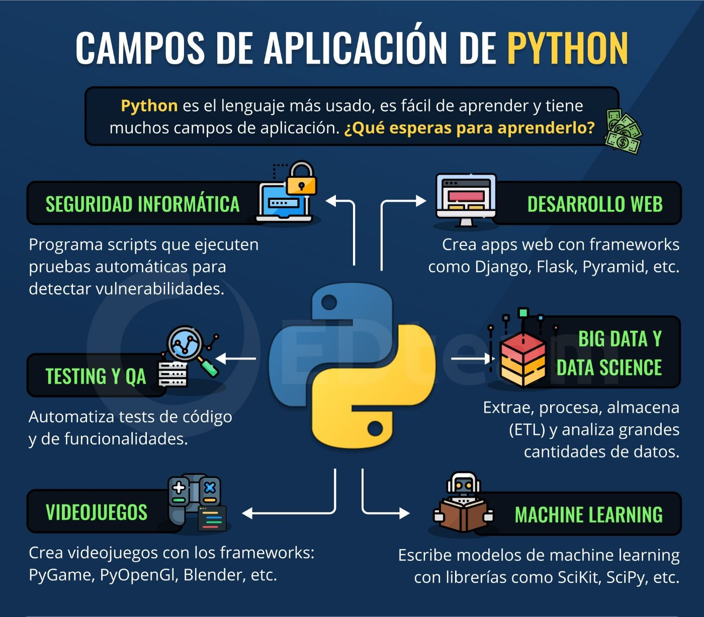
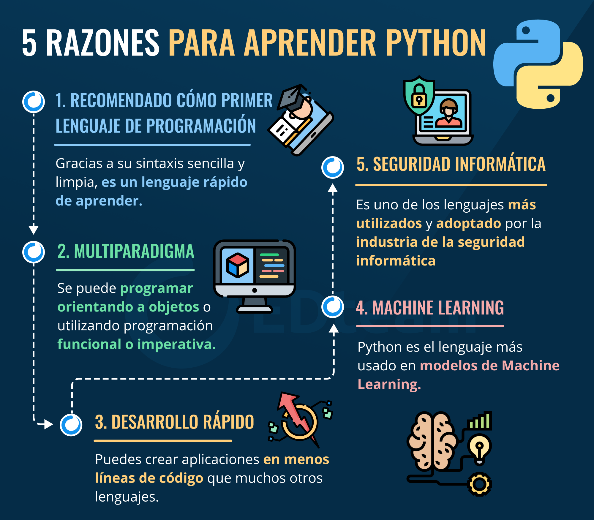
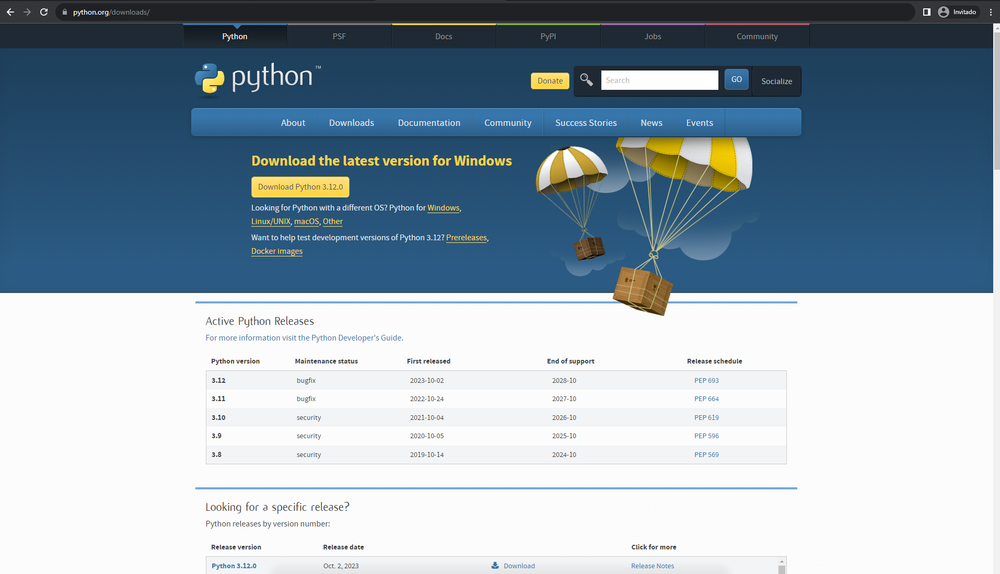
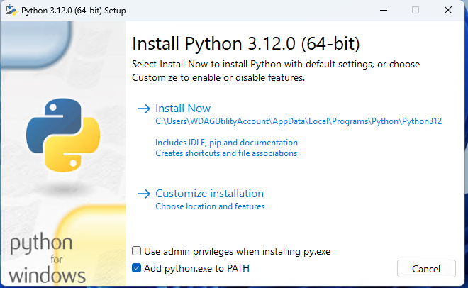
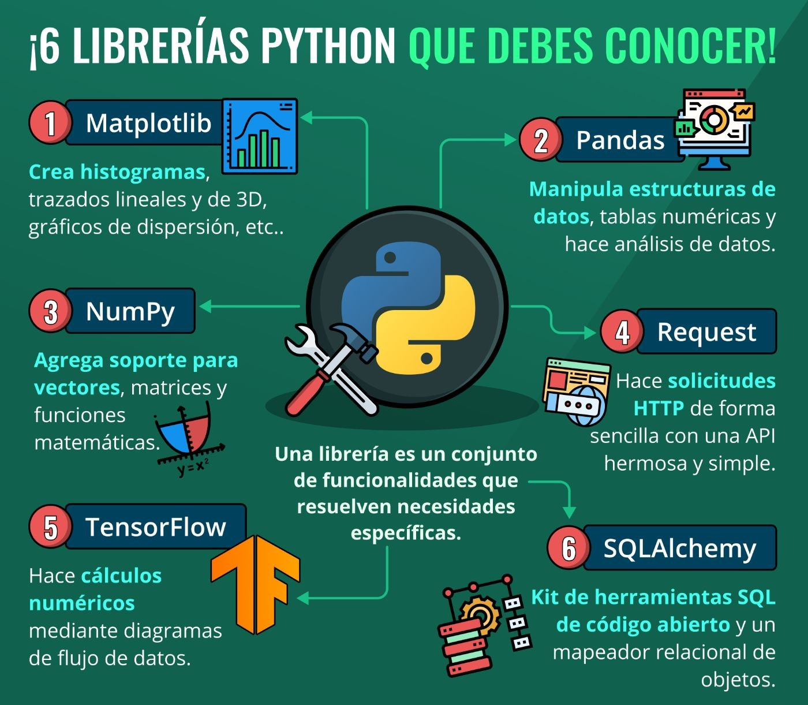
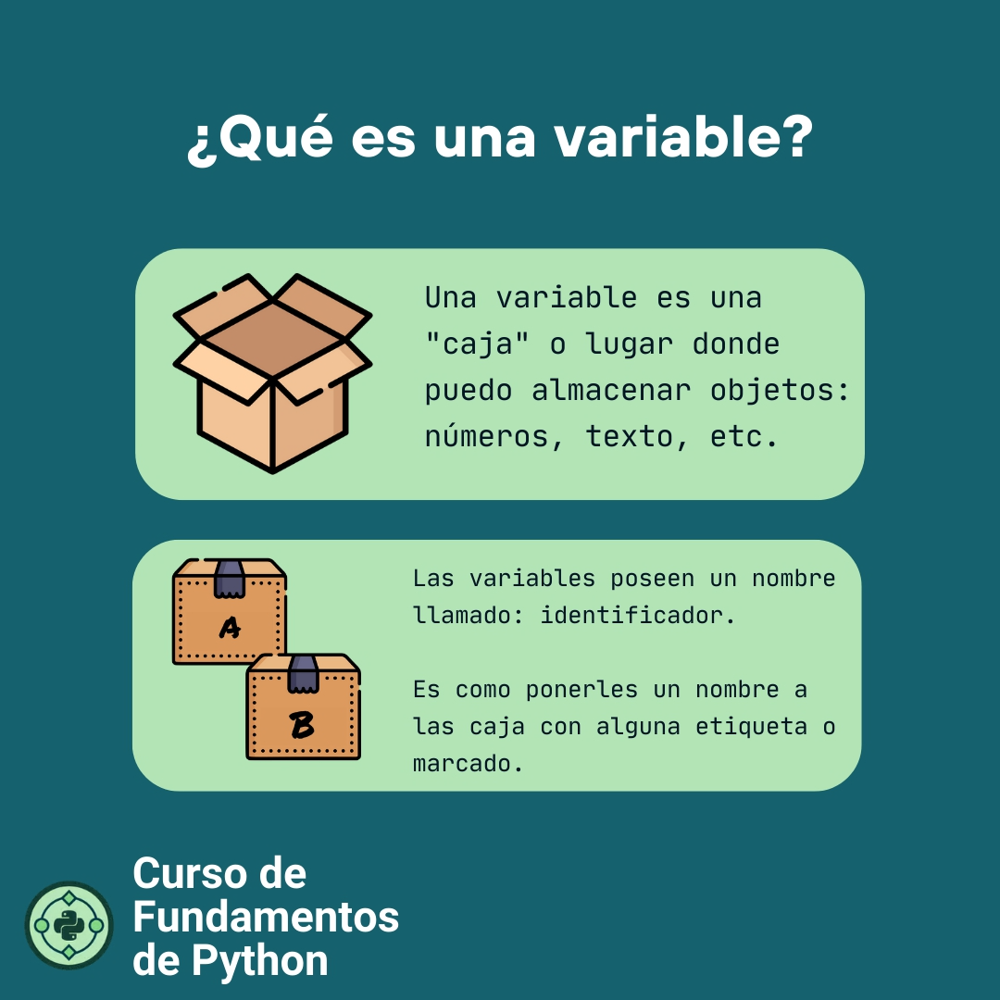

# PYTHON


¡Hola a todos los futuros programadores y programadoras! En este emocionante viaje hacia el mundo de la programación, hoy vamos a explorar un lenguaje de programación súper versátil y poderoso llamado Python. Pero antes de sumergirnos en la magia de la codificación, necesitamos entender que es python y preparar nuestro entorno de desarrollo.


## ¿Qué es Python?<a name="python"></a>

Python es un lenguaje de programación que se ha vuelto extremadamente popular en todo el mundo. ¿Sabías que es el lenguaje detrás de aplicaciones web como Instagram y YouTube? ¡Increíble, verdad?

Python es un lenguaje de programación de alto nivel, interpretado y generalmente fácil de aprender. Fue creado por Guido van Rossum y lanzado por primera vez en 1991. Desde entonces, ha evolucionado y madurado hasta convertirse en uno de los lenguajes de programación más populares y utilizados en todo el mundo.

¿Sabías que Python comenzó como un proyecto de hobby? Su creador, Guido van Rossum, era un apasionado de la programación y quería crear un lenguaje que fuera fácil de entender y poderoso. En diciembre de 1989, mientras buscaba un proyecto para mantenerse ocupado, decidió crear un intérprete para un nuevo lenguaje de scripting que había estado ideando. ¿Sabes qué le inspiró para nombrarlo "Python"? ¡Su amor por el grupo de comedia Monty Python! Así que, aunque parezca extraño, este lenguaje debe su nombre a un grupo de comediantes británicos.

### La Versatilidad de Python

Una de las razones por las que Python se ha vuelto tan popular es su versatilidad. Puedes usar Python para muchas cosas diferentes. Aquí hay algunos ejemplos:

- **Desarrollo Web**: Python se utiliza para crear sitios web. Maneja tareas como el envío y procesamiento de datos, la comunicación con bases de datos y la seguridad.

- **Desarrollo de Software**: En el desarrollo de software, Python puede ayudar en el control de construcción, seguimiento de errores y automatización de pruebas.

- **Ciencia de Datos**: Python es una herramienta esencial en el análisis de datos. Puede manejar grandes conjuntos de datos y realizar análisis complejos.

- **Automatización de Procesos**: Python puede automatizar tareas repetitivas, lo que lo hace útil en la industria para ahorrar tiempo y recursos.

- **Inteligencia Artificial y Aprendizaje Automático**: Gracias a su ecosistema de bibliotecas, Python es perfecto para proyectos de inteligencia artificial y aprendizaje automático.

- **Desarrollo de Juegos**: Incluso se usa en la creación de videojuegos populares como Los Sims 4 y Battlefield 2.



### Razones para Aprender Python

Ahora, te preguntarás por qué deberías aprender Python. Bueno, aquí tienes algunas razones:

- **Fácil de Leer**: Python se enorgullece de tener una sintaxis fácil de entender, lo que lo hace perfecto para principiantes.

- **Código Abierto y Gratuito**: ¡Puedes usar Python de forma gratuita! Incluso para proyectos comerciales.

- **Gran Comunidad**: Si te encuentras con un problema, es probable que alguien más ya lo haya resuelto. La comunidad de Python es enorme y solidaria.

- **Portabilidad**: Puedes escribir código Python en una plataforma y ejecutarlo en otra sin problemas.



Python es un lenguaje de programación fascinante que se ha convertido en una herramienta esencial en el mundo de la tecnología. Grandes empresas como NASA, Google, Netflix y Spotify confían en Python para impulsar sus servicios y productos.

Así que, si estás pensando en aprender programación, Python es un excelente lugar para empezar. ¡Es una habilidad con un gran futuro y una demanda creciente en la industria!

## Configuración del Entorno de Desarrollo<a name="install-py"></a>

Ahora, hablemos sobre la configuración de tu "entorno de desarrollo". Esto suena un poco complicado, ¡pero no te preocupes! Básicamente, es el lugar donde escribirás, probarás y ejecutarás tu código Python. 

Configurar un entorno de desarrollo de Python es el primer paso esencial para cualquier programador que quiera comenzar a trabajar con este versátil lenguaje de programación. Ya sea que estés planeando desarrollar aplicaciones web, explorar la inteligencia artificial o simplemente aprender a programar, la configuración adecuada del entorno te ayudará a empezar de manera efectiva. En este apartado, te guiaré a través de los pasos iniciales para configurar tu entorno de desarrollo de Python.


### 1. Instala Python

Imagina que Python es como una pluma antes de comenzar a escribir en el mundo de la programación. Es una herramienta fundamental que necesitas tener en tu caja de herramientas informáticas. Afortunadamente, instalar Python en tu computadora es un proceso sencillo y esencial para cualquier aspirante a programador.

#### **Paso 1: Descarga Python**

El primer paso es obtener el software Python en tu computadora. Para hacerlo, simplemente visita el sitio web oficial de Python en [python.org](https://www.python.org/downloads/). Allí encontrarás la última versión disponible para descargar.



#### **Paso 2: Instalación en Sistemas Unix (Linux o macOS)**

Si estás utilizando un sistema operativo basado en Unix, como Linux o macOS, es posible que ya tengas una versión de Python preinstalada. Sin embargo, te recomendamos encarecidamente que utilices la última versión disponible desde el sitio web oficial.

Una vez que hayas descargado el archivo de instalación, ejecútalo siguiendo las instrucciones. Esto asegurará que estás utilizando la versión más actualizada de Python.

#### **Paso 3: Instalación en Windows**

Para los usuarios de Windows, también puedes descargar Python desde el sitio web oficial. Durante la instalación, asegúrate de marcar la casilla que dice "Agregar Python X.X a PATH" (donde "X.X" es la versión de Python). Esto es importante porque permite que Python sea fácilmente accesible desde la línea de comandos de Windows.



Una vez que hayas completado estos pasos, habrás instalado Python en tu sistema. Ahora estás listo para aventurarte en el emocionante mundo de la programación.

### 2. Elige un Editor de Texto<a name="editor"></a>


El siguiente paso es elegir un editor de código o un IDE que te ayude a escribir y depurar código de Python de manera eficiente. Algunas opciones populares incluyen:

- **Visual Studio Code (VSCode)**: Es un editor de código gratuito y altamente personalizable que ofrece una excelente experiencia para programar en Python. Puedes instalar extensiones como "Python" y "Pylance" para mejorar aún más la funcionalidad.

- **PyCharm**: Es un IDE específicamente diseñado para Python. La versión Community es gratuita y ofrece una gran cantidad de características útiles para los desarrolladores de Python.

- **Jupyter Notebook**: Es una herramienta fantástica para la exploración de datos y el desarrollo interactivo de Python. Viene preinstalado en Anaconda, una distribución de Python que es popular en el ámbito de la ciencia de datos.


### Paso 3: Instalar Bibliotecas y Dependencias

La mayoría de los proyectos de Python requerirán bibliotecas y dependencias adicionales. Puedes utilizar la herramienta `pip` para instalar paquetes de Python. Por ejemplo, para instalar la popular biblioteca NumPy, simplemente ejecuta:

```bash
pip install numpy
```

Recuerda que si estás utilizando un entorno virtual, debes activarlo antes de usar `pip` para asegurarte de que las bibliotecas se instalen en el entorno correcto.



## Paso 5: ¡Comienza a Programar!<a name="primer-programa"></a>

¡Ahora que has configurado tu entorno de desarrollo de Python, estás listo para empezar a programar! Puedes escribir código Python en tu editor de elección, ejecutarlo y ver los resultados. Python es un lenguaje versátil con una amplia comunidad y recursos en línea, por lo que siempre encontrarás ayuda y documentación disponibles cuando la necesites.

#### 3. ¡Hola, Mundo!

Ahora que todo está configurado, es hora de hacer tu primer programa Python. Abre tu editor de texto y escribe lo siguiente:

```python
print("¡Hola, Mundo!")
```

Luego, guarda el archivo con una extensión ".py", por ejemplo, "mi_primer_programa.py". Esto le dice a tu computadora que es un programa de Python.

#### 4. Ejecuta tu Programa

Abre tu línea de comandos (si usas Windows, es el "Símbolo del sistema" o "CMD"; en Mac o Linux, es la "Terminal"). Navega a la ubicación donde guardaste tu archivo ".py" y escribe:

```zsh
python mi_primer_programa.py
```

¡Y listo! Verás la frase "¡Hola, Mundo!" en la pantalla. ¡Has escrito y ejecutado tu primer programa Python!


### Semántica y Sintaxis en Python

Python, uno de los lenguajes de programación más populares del mundo, es conocido por su simplicidad y legibilidad. Pero para dominarlo, es fundamental entender dos conceptos clave: **sintaxis** y **semántica**. Mientras que la sintaxis en Python se refiere a las reglas que definen cómo se deben estructurar las instrucciones del código, la semántica se ocupa del significado de esas instrucciones. En este blog, exploraremos ambos conceptos, destacando su importancia y cómo afectan a tu código en Python.

#### ¿Qué es la Sintaxis en Python?

La sintaxis de Python es como la gramática de un idioma. Define las reglas sobre cómo deben estructurarse las instrucciones de código para que Python pueda entenderlas y ejecutarlas. A diferencia de otros lenguajes de programación que pueden tener una sintaxis más compleja, Python se destaca por su simplicidad y legibilidad, lo que lo hace ideal tanto para principiantes como para expertos.

**Ejemplo de Sintaxis:**

```python
# Un sencillo ejemplo de sintaxis en Python
nombre = "Alice"
print("Hola, " + nombre + "!")
```

En este código:

- La línea `nombre = "Alice"` asigna la cadena "Alice" a la variable `nombre`.
- La línea `print("Hola, " + nombre + "!")` imprime un saludo combinando texto estático y el valor de la variable.

En Python, es crucial respetar la indentación, ya que define bloques de código. Por ejemplo, en estructuras de control como `if`, `for`, y `while`, el código dentro del bloque debe estar correctamente indentado.

**Ejemplo de Indentación:**

```python
edad = 20

if edad >= 18:
    print("Eres mayor de edad.")
else:
    print("Eres menor de edad.")
```

Si no respetas la indentación, Python lanzará un error de sintaxis. Esto enfatiza la importancia de escribir código limpio y bien estructurado.

#### ¿Qué es la Semántica en Python?

La semántica en Python se refiere al significado de las instrucciones de código que escribes. Mientras que la sintaxis asegura que el código esté estructurado correctamente, la semántica asegura que el código haga lo que esperas que haga.

**Ejemplo de Semántica:**

```python
x = 10
y = "5"
z = x + y  # Esto lanzará un TypeError
```

En este ejemplo, aunque la sintaxis es correcta (no hay errores de sintaxis), el código tiene un problema semántico. No puedes sumar un entero (`x = 10`) con una cadena (`y = "5"`). Esto resultará en un error de tipo (`TypeError`). La semántica asegura que los tipos de datos sean compatibles entre sí y que las operaciones realizadas tengan sentido.

Otro aspecto importante de la semántica es el flujo lógico del programa. Considera el siguiente ejemplo:

```python
edad = 20

if edad >= 18:
    print("Eres menor de edad.")
else:
    print("Eres mayor de edad.")
```

Aunque este código tiene una sintaxis correcta, semánticamente es incorrecto, ya que la condición del `if` está invertida. Este tipo de errores pueden ser difíciles de detectar porque el código se ejecuta sin errores de sintaxis, pero el resultado no es el deseado.

#### Importancia de Comprender la Sintaxis y Semántica

Entender la diferencia entre sintaxis y semántica es crucial para cualquier programador de Python. La sintaxis es el primer paso: si no escribes el código correctamente, Python no podrá ejecutarlo. Pero incluso con la sintaxis correcta, debes asegurarte de que tu código tenga sentido lógico y haga lo que pretendes.

Errores semánticos pueden llevar a resultados inesperados o, en el peor de los casos, a fallos en tu programa. Por eso, además de aprender las reglas sintácticas, es vital desarrollar una comprensión profunda de cómo Python maneja los diferentes tipos de datos, estructuras de control, y cómo interactúan entre sí.


La combinación de una sintaxis clara y una semántica lógica es lo que hace que Python sea un lenguaje tan poderoso y flexible. Al dominar ambos aspectos, estarás en el camino correcto para escribir código eficiente y libre de errores. Recuerda que la práctica constante y el análisis crítico de tu código son claves para mejorar tanto en la sintaxis como en la semántica.

¡Ahora que entiendes mejor estos conceptos, estás listo para escribir código en Python con mayor confianza y precisión!


Ahora tienes Python en tu computadora y estás listo para comenzar tu emocionante viaje en el mundo de la programación. No te preocupes si al principio todo parece un poco confuso, ¡todos empezamos desde algún lugar!

# Variables<a name="variables"></a>

Ahora vamos a adentrarnos en el emocionante mundo de Python y explorar un concepto fundamental: las variables. No te preocupes si esto suena un poco técnico, ¡lo explicaremos de manera sencilla y divertida!

### ¿Qué son las Variables en Python?

Imagina que una variable es como una caja mágica donde puedes guardar cosas. Cada vez que pones algo en la caja, le das un nombre para recordar lo que contiene. En Python, una variable es como esa caja mágica. Es un lugar donde puedes guardar datos y darles un nombre. ¿Por qué son importantes? Porque permiten que tu programa recuerde información y realice tareas inteligentes.



Por ejemplo, si quieres guardar tu edad en Python, puedes hacerlo así:

```python
edad = 12
```
### Nombres de Variables en Python

Puedes darles cualquier nombre a tus variables, pero hay algunas reglas que debes seguir:

- El nombre de la variable no puede comenzar con un número.
- Debe comenzar con una letra o un guión bajo.
- Puedes usar letras, números y guiones bajos en el nombre de la variable.
- Python distingue entre mayúsculas y minúsculas. "edad" y "Edad" serían dos variables diferentes.


#### Crear una Variable

En Python, crear una variable es súper fácil. Solo tienes que pensar en un nombre para tu variable y decirle a Python qué hay dentro. Por ejemplo:

```python
edad = 12
nombre = "Luis"
```

Aquí, hemos creado dos variables. "edad" guarda el número 12 y "nombre" guarda la palabra "Luis".

#### 2. Usar una Variable

Una vez que tienes una variable, puedes usarla en tu programa. Por ejemplo, podemos imprimir el valor de "edad" y "nombre" en la pantalla:

```python
print("Mi nombre es", nombre)
print("Tengo", edad, "años")
```

Cuando ejecutes este código, verás que Python toma el valor de las variables y lo muestra en la pantalla.

¡Las variables también pueden usarse en operaciones matemáticas!


### Cambiando el Valor de una Variable

Las variables pueden cambiar de valor. Por ejemplo, si celebramos un cumpleaños, podemos aumentar la edad en 1:

```python
edad = edad + 1
print("¡Feliz cumpleaños! Ahora tengo", edad, "años")
```

¡Ves cómo la variable "edad" cambia su valor?


# Tipos de datos<a name="tipos-datos"></a>

### Tipos de Datos en Variables

Imagina que tienes una caja mágica (sí, otra vez) y quieres guardar cosas en ella, pero esta vez quieres separarlas según lo que sean: números, palabras, etc. Los tipos de datos en Python son como etiquetas que te ayudan a organizar y trabajar con diferentes tipos de información.

Veamos algunos de los tipos de datos más comunes en Python:

- **Enteros (int)**: Guardan números enteros, como la edad en nuestro ejemplo.
- **Cadenas de Texto (str)**: Guardan palabras o frases, como el nombre.
- **Decimales (float)**: Guardan números con decimales, como 3.14.
- **Booleanos (bool)**: Guardan valores verdaderos o falsos, como True o False.

#### 1. Enteros (int)

Los números enteros son como tu edad, ¡números sin decimales! Por ejemplo:

```python
mi_edad = 12
```

En este caso, "mi_edad" es una variable de tipo entero que almacena el valor 12.

#### 2. Flotantes (float)

Los números flotantes son números con decimales. Por ejemplo:

```python
altura = 1.75
```

La variable "altura" es un flotante y contiene el valor 1.75.

#### 3. Cadenas de Texto (str)

Las cadenas de texto son como palabras o frases. Por ejemplo:

```python
nombre = "Ana"
```

La variable "nombre" es una cadena de texto que contiene el nombre "Ana".

#### 4. Booleanos (bool)

Los booleanos son como interruptores que pueden estar encendidos (True) o apagados (False). Por ejemplo:

```python
es_mayor_de_edad = False
```

La variable "es_mayor_de_edad" es un booleano y está configurada como False en este caso.

### ¿Por qué son Importantes los Tipos de Datos?

Los tipos de datos son esenciales porque determinan cómo se almacena y se maneja la información en Python. Por ejemplo, no querrías sumar una cadena de texto a un número, ¿verdad? Los tipos de datos te ayudan a evitar errores y a hacer que tu programa funcione de manera correcta.

### Ejemplos Prácticos

Veamos algunos ejemplos más interesantes:

```python
# Números
num1 = 10
num2 = 5
suma = num1 + num2
print("La suma de", num1, "y", num2, "es igual a", suma)

# Cadenas de Texto
saludo = "¡Hola, "
nombre = "María!"
mensaje = saludo + nombre
print(mensaje)

# Booleanos
es_mayor_de_edad = edad >= 18
print("¿Es mayor de edad?", es_mayor_de_edad)
```

¡Bien hecho! Ahora sabes lo que son las variables y cómo usarlas en Python. Son como cajas mágicas donde puedes guardar información importante. Recuerda darles nombres descriptivos para que puedas recordar fácilmente lo que contienen.

# Operadores en Python<a name="operadores"></a>

En programación, los operadores son herramientas que nos permiten realizar tareas como cálculos matemáticos, comparar valores y tomar decisiones. Vamos a ver los tipos de operadores más comunes en Python.

#### 1. Operadores Aritméticos

Los operadores aritméticos se utilizan para realizar cálculos matemáticos. Aquí tienes algunos ejemplos:

```python
# Suma
resultado_suma = 5 + 3
print("Suma:", resultado_suma)

# Resta
resultado_resta = 10 - 7
print("Resta:", resultado_resta)

# Multiplicación
resultado_multiplicacion = 4 * 6
print("Multiplicación:", resultado_multiplicacion)

# División
resultado_division = 12 / 3
print("División:", resultado_division)

# Módulo (resto de la división)
resultado_modulo = 10 % 3
print("Módulo:", resultado_modulo)
```
- Suma (+): `3 + 5` da como resultado `8`.
- Resta (-): `10 - 7` da como resultado `3`.
- Multiplicación (*): `4 * 6` da como resultado `24`.
- División (/): `12 / 3` da como resultado `4.0` (¡un flotante!).
- Módulo (%): `10 % 3` da como resultado `1` (el resto de la división).

#### 2. Operadores de Comparación

Los operadores de comparación se utilizan para comparar valores y devuelven un valor booleano (True o False). Aquí tienes ejemplos:

```python
# Igual
igual = 5 == 5
print("Igual:", igual)

# No igual
no_igual = 5 != 3
print("No igual:", no_igual)

# Mayor que
mayor_que = 7 > 3
print("Mayor que:", mayor_que)

# Menor que
menor_que = 4 < 2
print("Menor que:", menor_que)

# Mayor o igual que
mayor_o_igual_que = 6 >= 6
print("Mayor o igual que:", mayor_o_igual_que)

# Menor o igual que
menor_o_igual_que = 9 <= 8
print("Menor o igual que:", menor_o_igual_que)
```
- Igual (==): `5 == 5` da como resultado `True`.
- No igual (!=): `5 != 3` da como resultado `True`.
- Mayor que (>): `7 > 3` da como resultado `True`.
- Menor que (<): `4 < 2` da como resultado `False`.
- Mayor o igual que (>=): `6 >= 6` da como resultado `True`.
- Menor o igual que (<=): `9 <= 8` da como resultado `False`.

#### 3. Operadores Lógicos

Los operadores lógicos se utilizan para combinar condiciones y tomar decisiones. Aquí tienes ejemplos:

```python
# Y (and)
condicion_and = True and False
print("Y (and):", condicion_and)

# O (or)
condicion_or = True or False
print("O (or):", condicion_or)

# No (not)
condicion_not = not True
print("No (not):", condicion_not)
```
- Y (and): `True and False` da como resultado `False`.
- O (or): `True or False` da como resultado `True`.
- No (not): `not True` da como resultado `False`.

### **Ejemplo 1: Operaciones Aritméticas**

```python
edad = 12
altura = 1.5
suma = edad + altura

print("Edad:", edad)
print("Altura:", altura)
print("Resultado de la suma:", suma)
```

En este ejemplo, hemos utilizado el operador de suma `+` para sumar la variable `edad` y la variable `altura`. Luego, imprimimos los valores de `edad`, `altura` y el resultado de la suma utilizando la función `print()`.

### **Ejemplo 2: Operadores de Comparación**

```python
temperatura = 28
es_caluroso = temperatura > 30

print("Temperatura:", temperatura)
print("¿Es un día caluroso?", es_caluroso)
```

En este caso, hemos usado el operador de comparación "mayor que" (`>`) para verificar si la variable `temperatura` es mayor que 30. Luego, imprimimos el valor de `temperatura` y la variable `es_caluroso` que almacena el resultado de la comparación.

### **Ejemplo 3: Operadores Lógicos**

```python
es_dia_laboral = True
tengo_clases = True
puedo_ir_al_parque = es_dia_laboral and not tengo_clases

print("¿Es día laboral?", es_dia_laboral)
print("¿Tengo clases?", tengo_clases)
print("¿Puedo ir al parque?", puedo_ir_al_parque)
```

En este tercer ejemplo, hemos utilizado operadores lógicos. Primero, definimos las variables `es_dia_laboral` y `tengo_clases`. Luego, usamos el operador `and` para verificar si ambas condiciones son verdaderas y el operador `not` para negar la segunda condición. Finalmente, imprimimos los valores de las variables y el resultado de la operación lógica.

### Estructuras de Control en Python<a name="estructuras"></a>

Las estructuras de control son como las herramientas que nos permiten tomar decisiones y repetir acciones en nuestros programas. Imagina que eres un director de orquesta y tienes que dirigir a los músicos para que toquen en armonía. Las estructuras de control en Python son como tu batuta mágica que te permite dirigir el flujo de un programa. Te ayudan a tomar decisiones y repetir acciones según sea necesario.

Vamos a conocer dos tipos principales de estructuras de control en Python:

#### 1. Condicionales (if)<a name="estructura-if"></a>

Imagina que tienes un interruptor en tu habitación que enciende o apaga una luz. Las sentencias "if" en Python son como ese interruptor; te permiten tomar decisiones en tus programas. Puedes decirle a tu programa qué hacer si se cumple una condición y qué hacer si no.

Vamos a profundizar en cómo funcionan las sentencias "if" en Python:

#### Sintaxis de la Sentencia "if":

```python
if condición:
    # Código a ejecutar si la condición es verdadera
else:
    # Código a ejecutar si la condición es falsa
```

Las sentencias "if" se utilizan para evaluar si una condición es verdadera o falsa. Si la condición es verdadera, se ejecuta el bloque de código debajo del "if". Si es falsa, se ejecuta el bloque de código bajo el "else" (si está presente).

La estructura de control condicional (if) te permite tomar decisiones en tu programa. Aquí tienes unos ejemplos prácticos:

#### Ejemplo 1: Evaluando una Edad

```python
edad = 12

if edad < 18:
    print("Eres menor de edad.")
else:
    print("Eres mayor de edad.")
```

En este caso, el programa verifica si la edad es menor de 18 y muestra un mensaje adecuado.

#### Ejemplo 2: Verificando un Número Par

```python
numero = 7

if numero % 2 == 0:
    print("El número es par.")
else:
    print("El número es impar.")
```

Aquí, el programa verifica si un número es par o impar y muestra un mensaje en consecuencia.

¡Magnífico! Ahora conoces las sentencias "if" en Python y cómo usarlas para tomar decisiones en tus programas. Estas sentencias son como las instrucciones que das a tu programa para que tome caminos diferentes según las condiciones.

#### 2. Estructura de Control de Bucle (for)<a name="ciclo-for"></a>

Imagina que tienes una lista de tareas y quieres realizar una acción para cada elemento de la lista. El bucle "for" en Python es como tu asistente personal que te ayuda a recorrer y realizar acciones en cada elemento de una secuencia, como una lista o una cadena de texto.

Vamos a adentrarnos en cómo funciona el bucle "for" en Python:

#### Sintaxis del Bucle "for":

```python
for elemento in secuencia:
    # Código a ejecutar para cada elemento
```

El bucle "for" se utiliza para iterar a través de una secuencia (como una lista) y ejecutar un bloque de código para cada elemento en esa secuencia.

La estructura de control de bucle (for) te permite repetir acciones un número específico de veces. Por ejemplo:
#### Ejemplo 1: Iterando a través de una Lista

```python
nombres = ["Alice", "Bob", "Charlie", "David"]

for nombre in nombres:
    print("Hola,", nombre)
```

En este caso, el bucle "for" recorre la lista de nombres y saluda a cada persona.

#### Ejemplo 2: Contando Hasta un Número

```python
numero_limite = 5

for numero in range(numero_limite):
    print("Número:", numero)
```

Aquí, el bucle "for" cuenta desde 0 hasta el número límite.

¡Fantástico! Ahora conoces el bucle "for" en Python y cómo usarlo para recorrer secuencias y realizar acciones en cada elemento. El bucle "for" es como un explorador que te guía a través de un mapa de datos.

#### 3. Estructura de Control de Bucle (while)<a name="ciclo-while"></a>

Imagina que estás buscando un tesoro y sigues buscando hasta que encuentras una "X" en el mapa. El bucle "while" en Python es como tu búsqueda de tesoro; te permite repetir una acción mientras se cumpla una condición.

Vamos a explorar cómo funciona el bucle "while" en Python:

#### Sintaxis del Bucle "while":

```python
while condición:
    # Código a ejecutar mientras se cumpla la condición
```

El bucle "while" se utiliza para repetir un bloque de código mientras una condición sea verdadera. Si la condición se vuelve falsa en algún momento, el bucle se detiene.


#### Ejemplo 1: Contando Hasta un Número

```python
numero = 1

while numero <= 5:
    print("Número:", numero)
    numero += 1
```

En este caso, el bucle "while" cuenta desde 1 hasta 5 y muestra los números.

#### Ejemplo 2: Adivinando un Número

```python
numero_secreto = 7
intentos = 0

while True:
    intento = int(input("Adivina el número secreto: "))
    intentos += 1

    if intento == numero_secreto:
        print("¡Correcto! ¡Lo adivinaste en", intentos, "intentos!")
        break
```

Aquí, el bucle "while" permite adivinar un número secreto y se detiene cuando se adivina correctamente.

¡Increíble! Ahora conoces el bucle "while" en Python y cómo usarlo para repetir acciones mientras se cumple una condición. El bucle "while" es como una búsqueda emocionante que continúa hasta que se alcanza el objetivo.

# Funciones<a name="funciones"></a>

Las funciones son bloques de código reutilizable que te ayudan a organizar y simplificar tu programa.

Imagina que tienes un libro de recetas y cada receta es una serie de pasos para cocinar un delicioso platillo. Las funciones en Python son como esas recetas; te permiten agrupar un conjunto de instrucciones en un solo lugar y darle un nombre. Esto hace que tu programa sea más organizado y fácil de entender.

Vamos a descubrir cómo funcionan las funciones en Python:

#### Sintaxis de una Función en Python:

```python
def nombre_de_la_funcion(parametro1, parametro2):
    # Código a ejecutar
    resultado = parametro1 + parametro2
    return resultado
```

- `def`: Esta palabra clave se utiliza para definir una función en Python.
- `nombre_de_la_funcion`: Es el nombre que eliges para tu función.
- `parametro1` y `parametro2`: Son valores que puedes pasar a la función para que los use en su interior.
- `return`: Es la palabra clave que se utiliza para devolver un valor desde la función.

#### Ejemplo 1: Función que Saluda

```python
def saludar(nombre):
    mensaje = "¡Hola, " + nombre + "!"
    return mensaje

nombre_usuario = "Alice"
saludo = saludar(nombre_usuario)
print(saludo)
```

En este caso, creamos una función llamada `saludar` que toma un nombre como parámetro y devuelve un mensaje de saludo.

#### Ejemplo 2: Función que Calcula el Cuadrado

```python
def calcular_cuadrado(numero):
    cuadrado = numero * numero
    return cuadrado

numero_ingresado = 5
resultado = calcular_cuadrado(numero_ingresado)
print("El cuadrado de", numero_ingresado, "es", resultado)
```

Aquí, creamos una función llamada `calcular_cuadrado` que toma un número como parámetro y devuelve su cuadrado.

¡Excelente trabajo! Ahora conoces las funciones en Python y cómo usarlas para agrupar y reutilizar código. Las funciones son como herramientas que puedes utilizar una y otra vez en diferentes partes de tu programa.

# Módulos<a name="modulos"></a>

Imagina que estás construyendo una ciudad y necesitas diferentes tipos de edificios: escuelas, hospitales, y más. Los módulos en Python son como esos edificios especializados que puedes agregar a tu ciudad de Python. Cada módulo contiene funciones y variables que puedes utilizar en tu programa.

Vamos a descubrir cómo funcionan los módulos en Python:

#### Importando un Módulo:

```python
import nombre_del_modulo
```

Para usar un módulo en Python, primero debes importarlo. Esto te permite acceder a las funciones y variables que contiene.

#### Ejemplo 1: Usando el Módulo "math"

```python
import math

# Calculando la raíz cuadrada
numero = 25
raiz = math.sqrt(numero)
print("La raíz cuadrada de", numero, "es", raiz)

# Calculando el seno
angulo = 45
seno = math.sin(math.radians(angulo))
print("El seno de", angulo, "grados es", seno)
```

En este caso, importamos el módulo "math" y utilizamos sus funciones para calcular la raíz cuadrada y el seno de un número.

#### Ejemplo 2: Usando el Módulo Personalizado

Supongamos que tienes un archivo llamado "mi_modulo.py" con el siguiente contenido:

```python
# mi_modulo.py

def saludar(nombre):
    return "¡Hola, " + nombre + "!"

def doble(numero):
    return numero * 2
```

Ahora, puedes usar este módulo personalizado en tu programa principal:

```python
import mi_modulo

nombre = "Alice"
saludo = mi_modulo.saludar(nombre)
print(saludo)

numero = 5
resultado = mi_modulo.doble(numero)
print("El doble de", numero, "es", resultado)
```

Aquí, importamos el módulo personalizado "mi_modulo.py" y utilizamos sus funciones en nuestro programa principal.

¡Fantástico! Ahora conoces los módulos en Python y cómo usarlos para aprovechar funciones y variables adicionales. Los módulos son como tesoros de código que puedes agregar a tu programa para hacerlo más poderoso.
# Excepciones<a name="excepciones"></a>

Imagina que estás cocinando tu plato favorito y te das cuenta de que te falta un ingrediente importante. Las excepciones en Python son como esos momentos inesperados en la programación donde algo sale mal, y necesitas manejar la situación de manera elegante.

Vamos a descubrir cómo funcionan las excepciones en Python:

#### Uso de `try` y `except`:

```python
try:
    # Código que podría generar una excepción
except TipoDeExcepcion:
    # Código a ejecutar si se produce una excepción del tipo especificado
```

- `try`: Este bloque contiene el código que podría generar una excepción.
- `except`: Si ocurre una excepción del tipo especificado, este bloque se ejecuta para manejarla.

#### Ejemplo 1: Manejando una División por Cero

```python
try:
    numerador = 10
    denominador = 0
    resultado = numerador / denominador
except ZeroDivisionError:
    print("¡Error! No puedes dividir entre cero.")
else:
    print("El resultado es:", resultado)
```

En este caso, utilizamos `try` y `except` para manejar una posible excepción cuando intentamos dividir por cero.

#### Ejemplo 2: Manejando un Valor no Numérico

```python
try:
    entrada = input("Ingresa un número: ")
    numero = float(entrada)
except ValueError:
    print("¡Error! Debes ingresar un número válido.")
else:
    print("El número ingresado es:", numero)
```

Aquí, usamos `try` y `except` para manejar la posibilidad de que el usuario ingrese un valor que no sea numérico.

¡Excelente trabajo! Ahora conoces cómo manejar excepciones en Python utilizando `try` y `except`. Esto te permite lidiar con situaciones inesperadas de manera controlada y elegante en tus programas.

Con esto, completamos nuestra primera semana de aprendizaje de Python. ¡Esperamos que estos conceptos te ayuden a dar tus primeros pasos en la programación con Python! En la próxima semana, continuaremos explorando más elementos emocionantes de Python, como listas, diccionarios y más.

¡Mantente atento y sigue aprendiendo! 🐍🚀

---

¡Hola, jóvenes entusiastas de Python! Hoy vamos a adentrarnos en un tema emocionante y esencial: las listas en Python.

### ¿Qué son las Listas en Python?<a name="listas"></a>

Imagina que tienes una caja de LEGO con diferentes piezas. Las listas en Python son como esa caja; te permiten almacenar una colección de elementos en un solo lugar. Puedes pensar en ellas como un conjunto de elementos ordenados que puedes modificar, agregar o eliminar según tus necesidades.

Vamos a adentrarnos en cómo funcionan las listas en Python:

#### Creación de una Lista:

```python
mi_lista = [1, 2, 3, 4, 5]
```

Las listas se crean utilizando corchetes `[]` y los elementos se separan por comas.

#### Ejemplo 1: Creando una Lista de Nombres

```python
nombres = ["Alice", "Bob", "Charlie", "David"]
```

Aquí, creamos una lista de nombres. Puedes acceder a cada nombre por su posición en la lista.

#### Ejemplo 2: Modificando una Lista

```python
colores = ["rojo", "verde", "azul"]
colores[1] = "amarillo"
```

En este caso, cambiamos el segundo elemento de la lista de "verde" a "amarillo".

En Python, las listas utilizan indexación basada en cero, lo que significa que el primer elemento de la lista tiene un índice de 0, el segundo elemento tiene un índice de 1, el tercer elemento tiene un índice de 2 y así sucesivamente. Por lo tanto, cuando se cambia el valor en la posición 1 de la lista, se está haciendo referencia al segundo elemento de la lista.

La lista `colores` contiene tres elementos:

- El elemento en la posición 0 es "rojo".
- El elemento en la posición 1 es "verde".
- El elemento en la posición 2 es "azul".

Al ejecutar la línea `colores[1] = "amarillo"`, estás reemplazando el valor en la posición 1 (que es "verde") por "amarillo". Por lo tanto, el segundo elemento de la lista cambia de "verde" a "amarillo", y la lista resultante es `["rojo", "amarillo", "azul"]`.

Es importante recordar que la indexación basada en cero es una característica común en muchos lenguajes de programación y puede requerir cierta familiarización para trabajar con listas y otros tipos de secuencias en Python.

#### Ejemplo 3: Agregando y Eliminando Elementos

```python
frutas = ["manzana", "banana", "cereza"]
frutas.append("uva")  # Agregar un elemento al final
frutas.insert(1, "naranja")  # Insertar un elemento en una posición específica
frutas.remove("banana")  # Eliminar un elemento por valor
```

Aquí, mostramos cómo agregar elementos al final o en una posición específica, y cómo eliminar elementos de la lista.


1. **Agregar un elemento al final de la lista:**
   
   La línea `frutas.append("uva")` agrega la cadena "uva" al final de la lista `frutas`. Como resultado, la lista `frutas` se verá así:

   ```python
   ["manzana", "banana", "cereza", "uva"]
   ```

   La función `append()` agrega el elemento al final de la lista sin importar la posición anterior de los elementos.

2. **Insertar un elemento en una posición específica:**

   La línea `frutas.insert(1, "naranja")` inserta la cadena "naranja" en la posición 1 de la lista `frutas`. Esto desplaza el elemento anterior en esa posición hacia la derecha. La lista resultante será:

   ```python
   ["manzana", "naranja", "banana", "cereza", "uva"]
   ```

   La función `insert()` toma dos argumentos: la posición en la que se desea insertar el elemento y el elemento en sí.

3. **Eliminar un elemento por valor:**

   La línea `frutas.remove("banana")` elimina el elemento "banana" de la lista `frutas`. Después de esta operación, la lista se verá de la siguiente manera:

   ```python
   ["manzana", "naranja", "cereza", "uva"]
   ```

   La función `remove()` busca el valor especificado y elimina la primera ocurrencia de ese valor en la lista. Si hubiera múltiples "banana" en la lista, solo se eliminaría la primera.

Estas operaciones son esenciales para manipular listas en Python. Puedes agregar elementos al final o en posiciones específicas, y también eliminar elementos según su valor. Es importante tener en cuenta que las listas en Python son flexibles y permiten una amplia gama de operaciones para administrar datos.

¡Fantástico! Ahora conoces las listas en Python y cómo utilizarlas para organizar colecciones de elementos. Las listas son como contenedores versátiles que te permiten trabajar con datos de manera eficiente.

### ¿Qué son las Tuplas en Python?<a name="tuplas"></a>

Imagina que tienes una caja de joyas con piedras preciosas que no puedes modificar. Las tuplas en Python son como esas cajas; te permiten almacenar una colección de elementos, pero a diferencia de las listas, las tuplas son inmutables, lo que significa que no puedes cambiar su contenido una vez que se crean.

Vamos a adentrarnos en cómo funcionan las tuplas en Python:

#### Creación de una Tupla:

```python
mi_tupla = (1, 2, 3, 4, 5)
```

Las tuplas se crean utilizando paréntesis `()` y los elementos se separan por comas.

#### Ejemplo 1: Creando una Tupla de Coordenadas

```python
coordenadas = (3, 4)
```

Aquí, creamos una tupla que representa las coordenadas (3, 4).Esto puede ser útil, por ejemplo, en geometría para representar puntos en un plano.

#### Ejemplo 2: Intentando Modificar una Tupla

```python
mi_tupla = (1, 2, 3)
mi_tupla[1] = 5  # ¡Esto generará un error!
```

En este caso, intentamos modificar el segundo elemento de la tupla, pero como mencioné antes, las tuplas son inmutables, por lo que generará un error.

#### Ejemplo 3: Usando Tuplas en Funciones

```python
def dividir_y_redondear(numero1, numero2):
    cociente = numero1 / numero2
    resto = numero1 % numero2
    return (cociente, resto)

resultado = dividir_y_redondear(10, 3)
print("Cociente:", resultado[0])
print("Resto:", resultado[1])
```

En este último ejemplo, hemos definido una función llamada `dividir_y_redondear` que toma dos números como entrada, realiza una división y cálculo de resto, y devuelve una tupla con los resultados. Luego, llamamos a la función con los valores 10 y 3, y almacenamos la tupla resultante en la variable `resultado`. Finalmente, imprimimos el cociente y el resto accediendo a los elementos de la tupla utilizando la indexación, es decir, `resultado[0]` para el cociente y `resultado[1]` para el resto. Las tuplas son útiles para devolver múltiples valores desde una función.

### ¿Qué son los Diccionarios en Python?<a name="diccionario"></a>

Imagina que tienes un cuaderno donde puedes anotar definiciones de palabras junto con sus significados. Los diccionarios en Python son como ese cuaderno; te permiten almacenar pares de "palabra" (clave) y "definición" (valor). Los diccionarios son una forma eficiente de gestionar datos estructurados.

Vamos a adentrarnos en cómo funcionan los diccionarios en Python:

#### Creación de un Diccionario:

```python
mi_diccionario = {"manzana": "una fruta roja y deliciosa", "coche": "un vehículo de cuatro ruedas"}
```

Los diccionarios se crean utilizando llaves `{}` y los pares clave-valor se separan por comas.

#### Ejemplo 1: Accediendo a un Valor por Clave

```python
mi_diccionario = {"manzana": "una fruta roja y deliciosa", "coche": "un vehículo de cuatro ruedas"}
print("Significado de 'manzana':", mi_diccionario["manzana"])
```

En este ejemplo, hemos creado un diccionario llamado `mi_diccionario` con dos pares clave-valor. La clave "manzana" se asocia con el valor "una fruta roja y deliciosa", y la clave "coche" se asocia con el valor "un vehículo de cuatro ruedas".

Para acceder al valor asociado con una clave específica, utilizamos la sintaxis de corchetes y proporcionamos la clave. En este caso:

```python
print("Significado de 'manzana':", mi_diccionario["manzana"])
```

La línea de código anterior imprime el significado de la palabra "manzana" en nuestro "diccionario". En otras palabras, estamos accediendo al valor asociado con la clave "manzana" en el diccionario `mi_diccionario`.

Este enfoque es muy útil cuando necesitas buscar información asociada con una clave específica en un conjunto de datos, como definiciones en un diccionario o datos en una base de datos. Los diccionarios son una de las estructuras de datos más versátiles en Python y se utilizan ampliamente en la programación para el almacenamiento y recuperación eficiente de información.

#### Ejemplo 2: Agregando o Modificando Elementos
En Python, los diccionarios son estructuras de datos flexibles que permiten almacenar pares clave-valor. Puedes agregar nuevos elementos a un diccionario o modificar los valores existentes asociados con una clave específica. 

```python
mi_diccionario = {"manzana": "una fruta roja y deliciosa", "coche": "un vehículo de cuatro ruedas"}
mi_diccionario["bicicleta"] = "un vehículo de dos ruedas"
mi_diccionario["coche"] = "un vehículo de transporte motorizado"
```

#### **Agregando un Elemento:**

```python
mi_diccionario["bicicleta"] = "un vehículo de dos ruedas"
```

En esta línea, estamos agregando un nuevo elemento al diccionario. La clave es "bicicleta" y el valor asociado es "un vehículo de dos ruedas". El diccionario ahora contendrá tres elementos.

#### **Modificando un Elemento:**

```python
mi_diccionario["coche"] = "un vehículo de transporte motorizado"
```

Aquí, estamos modificando el valor asociado con la clave "coche". Originalmente, "coche" estaba relacionado con "un vehículo de cuatro ruedas", pero hemos actualizado el valor a "un vehículo de transporte motorizado".

Después de estas operaciones, el diccionario `mi_diccionario` se verá así:

```python
{
    "manzana": "una fruta roja y deliciosa",
    "coche": "un vehículo de transporte motorizado",
    "bicicleta": "un vehículo de dos ruedas"
}
```

Este ejemplo ilustra cómo los diccionarios en Python te permiten agregar nuevas entradas o actualizar los valores existentes con facilidad. Las claves deben ser únicas en un diccionario, pero los valores pueden ser cualquier tipo de dato. Los diccionarios son una herramienta poderosa para organizar y manipular datos en programas Python.

#### Ejemplo 3: Recorriendo un Diccionario

```python
mi_diccionario = {"manzana": "una fruta roja y deliciosa", "coche": "un vehículo de cuatro ruedas"}

for clave, valor in mi_diccionario.items():
    print("La", clave, "es", valor)
```

En este caso, recorremos el diccionario y mostramos todas las claves y sus respectivos valores.


En este fragmento de código, hemos utilizado un bucle `for` para recorrer el diccionario `mi_diccionario`. La función `items()` se usa para obtener pares clave-valor del diccionario. En cada iteración del bucle, la variable `clave` toma el valor de una clave y la variable `valor` toma el valor asociado con esa clave.

Dentro del bucle, estamos imprimiendo una oración que describe el par clave-valor. Por ejemplo, en la primera iteración, el bucle imprime "La manzana es una fruta roja y deliciosa". En la segunda iteración, imprimirá "El coche es un vehículo de cuatro ruedas".

Este enfoque es útil cuando necesitas realizar una acción o procesamiento en cada elemento del diccionario. Puedes acceder tanto a las claves como a los valores de forma individual y realizar tareas específicas en cada uno de ellos. Los bucles `for` junto con el método `items()` hacen que trabajar con diccionarios sea muy conveniente en Python.

¡Fantástico! Ahora conoces los diccionarios en Python y cómo utilizarlos para organizar datos estructurados de manera eficiente. Los diccionarios son como tu propio libro de definiciones personal.

### ¿Qué son los Conjuntos en Python?<a name="conjuntos"></a>

Imagina que tienes una colección de gemas preciosas y quieres asegurarte de que no haya duplicados. Los conjuntos en Python son como esa colección; te permiten almacenar elementos únicos y no duplicados. Son una excelente opción cuando necesitas mantener una lista de elementos distintos.

Vamos a adentrarnos en cómo funcionan los conjuntos en Python:

#### Creación de un Conjunto:

```python
mi_conjunto = {1, 2, 3, 4, 5}
```

Los conjuntos se crean utilizando llaves `{}` y los elementos se separan por comas.

#### Ejemplo 1: Creando un Conjunto de Colores

```python
colores = {"rojo", "verde", "azul"}
```

Aquí, creamos un conjunto de colores. Los elementos en un conjunto no tienen un orden específico.

#### Ejemplo 2: Agregando y Eliminando Elementos

```python
frutas = {"manzana", "banana", "cereza"}
frutas.add("uva")  # Agregar un elemento al conjunto
frutas.remove("banana")  # Eliminar un elemento del conjunto
```

En este caso, mostramos cómo agregar elementos al conjunto y cómo eliminar elementos del conjunto.

#### Ejemplo 3: Realizando Operaciones de Conjuntos

```python
A = {1, 2, 3, 4, 5}
B = {4, 5, 6, 7, 8}

union = A | B  # Unión de conjuntos
interseccion = A & B  # Intersección de conjuntos
diferencia = A - B  # Diferencia de conjuntos

print("Unión:", union)
print("Intersección:", interseccion)
print("Diferencia:", diferencia)
```

En este ejemplo, realizamos operaciones de conjuntos como unión, intersección y diferencia.

¡Excelente trabajo! Ahora conoces los conjuntos en Python y cómo utilizarlos para mantener una colección de elementos únicos. Los conjuntos son como cofres de tesoros que no permiten duplicados.

### Manejo de Archivos<a name="manejo-archivos"></a>

Imagina que tienes un diario donde escribes tus pensamientos y experiencias. En programación, los archivos son como esos diarios; te permiten almacenar y recuperar información de manera persistente. El manejo de archivos es esencial para tareas como leer datos de un archivo, escribir resultados o mantener registros de tu programa.

Vamos a adentrarnos en cómo funciona el manejo de archivos en Python:

#### Apertura de un Archivo:

```python
archivo = open("mi_archivo.txt", "r")  # Abre el archivo para lectura (read)
```

- `open`: La función `open` se utiliza para abrir un archivo.
- `"mi_archivo.txt"`: Es el nombre del archivo que deseamos abrir.
- `"r"`: Indica que queremos abrir el archivo en modo lectura. Otros modos incluyen "w" para escritura (write) y "a" para agregar contenido (append).

#### Ejemplo 1: Leer Contenido de un Archivo

```python
with open("mi_archivo.txt", "r") as archivo:
    contenido = archivo.read()
    print(contenido)
```

En este caso, abrimos el archivo en modo lectura y leemos su contenido.

#### Ejemplo 2: Escribir en un Archivo

```python
with open("mi_archivo.txt", "w") as archivo:
    archivo.write("Hola, este es un ejemplo de escritura en un archivo.")
```

Aquí, abrimos el archivo en modo escritura y escribimos una cadena de texto en él.

#### Ejemplo 3: Agregar Contenido a un Archivo

```python
with open("mi_archivo.txt", "a") as archivo:
    archivo.write("\nEste texto se agrega a continuación del contenido existente.")
```

En este ejemplo, abrimos el archivo en modo agregado y agregamos más texto al final.

¡Fantástico! Ahora conoces los conceptos básicos del manejo de archivos en Python. Esto te permitirá trabajar con datos almacenados en archivos y crear registros de tus programas.

Con esto, completamos nuestra segunda semana de aprendizaje de Python. ¡Esperando que estos conceptos te ayuden a ampliar tus habilidades y conocimientos en programación con Python! En la próxima semana, continuaremos explorando temas avanzados, como programación orientada a objetos y bibliotecas externas.

---

¡Saludos, jóvenes programadores de Python! Hoy, nos adentraremos en un emocionante mundo: la Programación Orientada a Objetos (POO) en Python.

### ¿Qué es la Programación Orientada a Objetos?<a name="poo"></a>

La programación orientada a objetos, o POO, es un paradigma de programación que nos permite abordar problemas complejos pensando en ellos como objetos. Un objeto en Python es una colección única de datos (atributos) y comportamiento (métodos).

La Programación Orientada a Objetos es como construir con bloques de LEGO. Imagina que tienes diferentes tipos de bloques (objetos) que puedes usar para construir cualquier cosa. En POO, los objetos son como esos bloques, y cada objeto tiene propiedades (atributos) y acciones (métodos).

## Programación Estructurada Vs. Programación Orientada a Objetos

La programación estructurada es el enfoque más común para principiantes, ya que es una forma sencilla de construir programas pequeños. Se trata de ejecutar un programa Python de forma secuencial. Sin embargo, este enfoque tiene sus desventajas cuando los proyectos crecen y se vuelven más complejos.

Imagina que estás en el emocionante mundo de la programación, listo para crear un programa para una cafetería. Tu misión: hacer que los clientes ingresen su presupuesto y mostrarles qué café pueden comprar. Parece una tarea sencilla, ¿verdad? Sin embargo, la elección de tu enfoque de programación puede hacer que esta tarea sea un paseo por el parque o una aventura laberíntica. Aquí es donde entran en juego dos enfoques diferentes: la programación estructurada y la programación orientada a objetos.

**La Programación Estructurada:**

Este enfoque es como la bicicleta de entrenamiento de los programadores principiantes. Comenzamos de manera sencilla, escribiendo líneas de código una tras otra. Aquí tienes un vistazo a cómo podría verse el código de una cafetería en un mundo estructurado:

```python
small = 2
regular = 5
big = 6

user_budget = input('¿Cuál es tu presupuesto? ')

try:
    user_budget = int(user_budget)
except:
    print('Por favor, introduce un número')
    exit()

if user_budget > 0:
    if user_budget >= big:
        print('Puedes comprar el café grande')
        if user_budget == big:
            print('Es exacto')
        else:
            print('Tu cambio es', user_budget - big)
    elif user_budget == regular:
        print('Puedes comprar el café regular')
        print('Es exacto')
    elif user_budget >= small:
        print('Puedes comprar el café pequeño')
        if user_budget == small:
            print('Es exacto')
        else:
            print('Tu cambio es', user_budget - small)
```

¡Funciona! Pero, oh, tiene mucho condicional anidado y lógica repetida. Modificarlo en el futuro podría ser un dolor de cabeza.

**La Programación Orientada a Objetos (POO):**

Ahora, piensa en la POO como tu máquina de café de alta gama. Es elegante, eficiente y personalizable. En lugar de escribir líneas y líneas de código, puedes organizar todo en una "caja" ordenada. Mira cómo funciona:

```python
class Coffee:
    def __init__(self, name, price):
        self.name = name
        self.price = float(price)

    def check_budget(self, budget):
        if not isinstance(budget, (int, float)):
            print('Ingresa un número o decimal')
            exit()
        if budget < 0:
            print('Lo siento, no tienes dinero')
            exit()

    def get_change(self, budget):
        return budget - self.price

    def sell(self, budget):
        self.check_budget(budget)
        if budget >= self.price:
            print(f'Puedes comprar el café {self.name}')
            if budget == self.price:
                print('Es exacto')
            else:
                print(f'Aquí tienes tu cambio: {self.get_change(budget)}$')
            exit('Gracias por tu compra')            
```

Este código luce diferente, ¿verdad? Hemos creado una "clase" llamada "Coffee" que contiene toda la información y lógica relacionada con el café. La belleza de esto es que podemos crear múltiples tipos de café sin lío.

Entonces, ¿cómo lo usamos? Simple, creamos objetos de café y los vendemos:

```python
small = Coffee('Pequeño', 2)
regular = Coffee('Regular', 5)
big = Coffee('Grande', 6)

try:
    user_budget = float(input('¿Cuál es tu presupuesto? '))
except ValueError:
    exit('Por favor, introduce un número')

for coffee in [big, regular, small]:
    coffee.sell(user_budget)
```

Ambos enfoques nos llevan al mismo resultado, pero la POO es como tener un equipo de baristas expertos que trabajan juntos de manera organizada y elegante. Es especialmente útil cuando tu proyecto crece y necesitas más funcionalidades. ¡Así que levanta tu taza de café y da la bienvenida a la programación orientada a objetos en tu vida!

### Todo en Python es un Objeto

Una característica destacada de Python es que todo es un objeto. Desde números, cadenas y listas hasta funciones y clases, todos ellos son objetos. Esto significa que todos los objetos tienen atributos y métodos que puedes utilizar.

Para acceder a los atributos y métodos de un objeto, utilizamos la notación de puntos. Por ejemplo, puedes convertir una cadena en mayúsculas con el método `upper()` o comprobar su tipo con `type()`.

```
my_string = "Hola, soy una cadena"
print(my_string.upper())  # Imprime la cadena en mayúsculas
print(type(my_string))  #

 Imprime el tipo de objeto
```

Si no quedó claro puedes ver este video explicado con minecraft:
[](https://youtu.be/I848HdWjLMo?si=NFPgYRX0TzdrO_TC)

## ¿Qué Son las Clases?<a name="clases"></a>

En términos sencillos, una clase es como un plano o plantilla para crear objetos. Un objeto es una instancia de una clase, y se comporta según las reglas definidas por esa clase. Puedes pensar en las clases como si fueran moldes y los objetos como las piezas de un rompecabezas.

## Creando una Clase en Python

Para definir una clase en Python, utilizamos la palabra clave `class`, seguida del nombre de la clase (generalmente en CamelCase). Aquí tienes un ejemplo simple:

```python
class Perro:
    pass
```

Hasta ahora, nuestra clase de perro está vacía, ¡como si fuera un perro sin características ni trucos! Pero no te preocupes, ¡le daremos vida a este perro en un momento!

## Creando un Objeto (Instancia)<a name="objetos"></a>

Una vez que has definido una clase, puedes crear objetos (instancias) de esa clase. Para hacerlo, simplemente llama a la clase como si fuera una función. Por ejemplo:

```python
mi_perro = Perro()  # Creamos una instancia de la clase Perro
```

¡Ahora tienes un perro virtual, mi_perro, que es un objeto de la clase Perro!

## Atributos de Clase

Los atributos son como las características o datos que pertenecen a una clase. Pueden variar de un objeto a otro. Aquí hay un ejemplo de cómo añadir atributos a nuestra clase Perro:

```python
class Perro:
    def __init__(self, nombre, raza):
        self.nombre = nombre
        self.raza = raza
```

En el ejemplo anterior, hemos creado un método especial llamado `__init__`, que se llama automáticamente cuando se crea un nuevo objeto. Este método se utiliza para inicializar los atributos del objeto. `self` hace referencia al objeto actual (en este caso, al perro que estamos creando).

Ahora puedes crear un perro con nombre y raza:

```python
mi_perro = Perro("Fido", "Labrador")
print(mi_perro.nombre)  # Imprime "Fido"
print(mi_perro.raza)  # Imprime "Labrador"
```

## Métodos de Clase

Los métodos son como las habilidades o funciones que un objeto puede realizar. Pueden interactuar con los atributos del objeto y realizar diversas tareas. Aquí tienes un ejemplo de cómo añadir un método a nuestra clase Perro:

```python
class Perro:
    def __init__(self, nombre, raza):
        self.nombre = nombre
        self.raza = raza
    
    def ladrar(self):
        print(f"{self.nombre} está ladrando: ¡Guau, guau!")
```

Ahora, tu perro virtual puede ladrar:

```python
mi_perro = Perro("Fido", "Labrador")
mi_perro.ladrar()  # Imprime "Fido está ladrando: ¡Guau, guau!"
```

Las clases en Python son una de las herramientas más versátiles y poderosas que tienes a tu disposición. Puedes crear objetos con atributos y métodos personalizados para representar conceptos y entidades del mundo real en tu código.

### Método constructor<a name="constructor"></a>

¿Alguna vez has deseado crear objetos con características únicas y bien definidas en Python? El "Método Constructor" es la respuesta a ese deseo. Este método se llama automáticamente cuando creas un nuevo objeto de una clase, y su función es inicializar los atributos de ese objeto. Imagina que estás fabricando robots en tu propia fábrica de Python. Cada robot tendrá su propio nombre, color y nivel de batería, ¡y el método constructor es la clave para lograrlo!

Veamos cómo funciona:

```python
class Robot:
    def __init__(self, nombre, color, bateria):
        self.nombre = nombre
        self.color = color
        self.bateria = bateria

# Crear un robot llamado R2-D2
robot1 = Robot("R2-D2", "Azul y blanco", 100)

# Crear otro robot llamado Wall-E
robot2 = Robot("Wall-E", "Marrón", 80)
```

En este ejemplo, hemos definido una clase llamada `Robot`. El método `__init__` toma cuatro parámetros: `self`, `nombre`, `color`, y `bateria`. El parámetro `self` hace referencia al objeto que está siendo creado. Luego, asignamos los valores de `nombre`, `color` y `bateria` a los atributos del robot utilizando `self`.

Ahora que hemos dado vida a nuestros robots, podemos personalizarlos según nuestras necesidades. Puedes acceder a los atributos de un objeto y modificarlos:

```python
# Acceder a los atributos del robot R2-D2
print(robot1.nombre)  # Imprime "R2-D2"
print(robot1.color)   # Imprime "Azul y blanco"
print(robot1.bateria) # Imprime 100

# Modificar la batería de Wall-E
robot2.bateria = 90
print(robot2.bateria) # Imprime 90
```

El método constructor `__init__` se encargó de crear nuestros robots con sus atributos iniciales, pero luego somos libres de personalizarlos como queramos.

#### **Por Qué el Método Constructor es Importante**

El método constructor es fundamental en la programación orientada a objetos. Permite la creación de objetos con atributos específicos, lo que los hace únicos y listos para realizar tareas particulares. Imagina que cada objeto es un personaje en tu propio mundo de programación, ¡y el método constructor es lo que les da vida y personalidad!

A medida que avances en tu viaje por Python, te darás cuenta de que el método constructor es solo el comienzo. Puedes agregar otros métodos y atributos a tus clases para hacer que tus objetos hagan cosas sorprendentes.

## Descifrando el Misterio de "self"

En el mundo de la programación orientada a objetos, los objetos son como personajes en una obra de teatro, y cada uno tiene su propia identidad y habilidades. El "self" es la forma en que Python le permite a un objeto referirse a sí mismo. Es como si cada actor en una obra de teatro tuviera un espejo mágico que refleja quiénes son y qué pueden hacer.

Para entender mejor, echemos un vistazo a un ejemplo:

```python
class Robot:
    def __init__(self, nombre, bateria):
        self.nombre = nombre
        self.bateria = bateria

    def saludar(self):
        return f"Hola, soy {self.nombre}."

# Crear un robot llamado R2-D2
robot1 = Robot("R2-D2", 100)

# Crear otro robot llamado Wall-E
robot2 = Robot("Wall-E", 80)

# Hacer que los robots saluden
saludo_robot1 = robot1.saludar()
saludo_robot2 = robot2.saludar()

print(saludo_robot1)  # Imprime "Hola, soy R2-D2."
print(saludo_robot2)  # Imprime "Hola, soy Wall-E."
```

En este ejemplo, hemos creado una clase llamada `Robot`. Dentro de la clase, el método `__init__` inicializa los atributos del robot. El método `saludar` utiliza "self" para acceder al nombre del robot. El "self" permite que cada robot hable en su propio nombre.

## ¿Por Qué es Importante "self"?

El "self" es fundamental en la programación orientada a objetos. Sin él, los objetos no podrían saber quiénes son ni interactuar con su propio conjunto de datos. Es lo que permite que un objeto acceda a sus atributos y métodos de una manera específica.

Piensa en el "self" como el corazón de un objeto. Es lo que hace que un objeto sea único y le permite actuar de acuerdo con su propia naturaleza. Cada objeto es como un actor en su propia historia, y el "self" es el guion que le dice qué hacer.

## Desentrañando el Misterio de la Herencia

La herencia es un concepto clave en la programación orientada a objetos (POO) y juega un papel vital en la creación de programas sólidos y organizados. En esencia, la herencia te permite **heredar** propiedades y comportamientos de una clase existente y construir una nueva clase sobre esa base.

Pensemos en la herencia de la siguiente manera: Imagina que eres un artista y tienes una paleta de colores con mezclas únicas. Ahora, quieres crear una nueva pintura, ¿comenzarías desde cero o usarías tus colores ya existentes como punto de partida? La herencia te permite aprovechar esas mezclas existentes para crear algo nuevo y emocionante.

## La Magia de la Herencia en Python

En Python, la herencia es sencilla y poderosa. Aquí tienes un ejemplo para ilustrar cómo funciona:

```python
class CriaturaMagica:
    def __init__(self, nombre, poder):
        self.nombre = nombre
        self.poder = poder

    def lanzar_hechizo(self):
        print(f"{self.nombre} lanza un hechizo.")

class Dragon(CriaturaMagica):
    def escupir_fuego(self):
        print(f"{self.nombre} escupe fuego y causa estragos.")
```

En este código, hemos definido dos clases. La clase `Dragon` hereda de la clase `CriaturaMagica`. Esto significa que un dragón no solo tiene sus propias características, como la capacidad de escupir fuego, sino que también hereda todas las características de una criatura mágica, como lanzar hechizos.

## La Magia Continúa

Ahora que hemos aprendido sobre la herencia, te preguntarás por qué es tan importante. La herencia es una herramienta mágica que te permite:

1. **Reutilizar código**: No necesitas empezar desde cero; puedes aprovechar las clases existentes.
2. **Organizar tu código**: Crea una estructura jerárquica que hace que tu programa sea más fácil de entender.
3. **Extender funcionalidad**: Agrega nuevas características a las clases base sin afectar su funcionamiento original.
4. **Mantiene tu código limpio y legible**: Al reducir la duplicación y mejorar la organización.

La herencia es una de las piedras angulares de la POO en Python. Te permite construir programas más flexibles y mantenibles. Ahora que has desbloqueado el poder de la herencia, te animo a explorar y experimentar por ti mismo. ¡Crea tus propias clases y observa cómo la herencia facilita la construcción de programas asombrosos!

Si no quedó claro puedes ver este video explicado con minecraft:
[](https://youtu.be/yh8bTKqCOtU?si=O4cIewNxbWpnHMbi)


## Encapsulación<a name="encapsulacion"></a>

La encapsulación se asemeja a un cofre fuerte que protege y oculta los detalles internos de un objeto. Imagina que eres un mago y tienes un libro de hechizos. ¿Permitirías que cualquiera vea tus hechizos más poderosos? Por supuesto que no. De manera similar, la encapsulación se trata de **ocultar los detalles internos** de un objeto y **exponer solo lo que es necesario**.

## Cómo Funciona la Encapsulación en Python

Python hace que la encapsulación sea sencilla mediante el uso de **atributos privados** y **métodos privados**. Esto significa que algunos componentes de una clase no son accesibles desde fuera de la clase.

```python
class SuperHeroe:
    def __init__(self, nombre, identidad_secreta):
        self.nombre = nombre          # Atributo público
        self.__identidad = identidad_secreta  # Atributo privado

    def revelar_identidad(self):
        return self.__identidad
```

En este ejemplo, `nombre` es un atributo público que puede ser accedido desde fuera de la clase. Sin embargo, `__identidad` es un atributo privado que solo puede ser accedido desde dentro de la clase. Esto protege la identidad secreta del superhéroe.

Si no quedó claro puedes ver este video explicado con minecraft:
[](https://youtu.be/8aQSD36paWU?si=6-ydXxb2cT3B_BsM)


## ¿Qué es el Polimorfismo?

El término "polimorfismo" proviene del griego y significa "muchas formas". En programación, el polimorfismo se refiere a la capacidad de diferentes objetos para responder a la misma llamada de método de manera específica para cada uno. En otras palabras, varios objetos pueden realizar la misma acción, pero de una manera que es relevante para ellos.

## Un Ejemplo Sencillo

Imagina una familia de mascotas con perros, gatos y pájaros. Todos ellos pueden hacer un sonido, pero cada uno lo hace de una manera única:

```python
class Mascota:
    def hacer_sonido(self):
        pass

class Perro(Mascota):
    def hacer_sonido(self):
        return "¡Guau!"

class Gato(Mascota):
    def hacer_sonido(self):
        return "¡Miau!"

class Pajaro(Mascota):
    def hacer_sonido(self):
        return "¡Pío!"
```

En este ejemplo, hemos creado una jerarquía de clases de mascotas con un método `hacer_sonido`. Cada tipo de mascota (perro, gato, pájaro) implementa este método de manera específica para sí mismo.

Si no quedó claro puedes ver este video explicado con minecraft:
[](https://youtu.be/bblFTvuk4pY?si=KYIQrYpdIC68Ub9e)


## Métodos de los Objetos: cadenas

Una cadena en Python es una secuencia inmutable de caracteres. Esto significa que una vez que una cadena se crea, no se puede modificar. Puedes definir una cadena simplemente encerrando un texto entre comillas simples (`'...'`) o dobles (`"..."`). Por ejemplo:

```python
mi_cadena = "Hola, mundo"
```

## Métodos Comunes de las Cadenas

### 1. `count(sub[, start[, end]])`

Este método devuelve el número de veces que se encuentra la subcadena `sub` en la cadena. Los parámetros opcionales `start` y `end` definen una subcadena en la que buscar.

```python
texto = "Hola, mundo. Hola, Python."
print(texto.count("Hola"))  # 2
print(texto.count("Hola", 0, 10))  # 1
print(texto.count("Hola", 0, 17))  # 2 porque el nuemro de caracteres abarcan los 2 textos hola
```

### 2. `find(sub[, start[, end]])`

Devuelve la posición en la que se encuentra por primera vez la subcadena `sub` en la cadena, o `-1` si no se encuentra. También puede recibir los parámetros opcionales `start` y `end` para definir una subcadena en la que buscar.

```python
frase = "Hola, mundo"
print(frase.find("mundo"))  # 6
print(frase.find("Python")) # -1
```

### 3. `join(sequence)`

Devuelve una cadena resultante de concatenar las cadenas de la secuencia `sequence`, separadas por la cadena sobre la que se llama el método.

```python
palabras = ["Hola", "Mundo", "Python"]
separador = " "
print(separador.join(palabras))  # "Hola Mundo Python"
```

### 4. `partition(sep)`

Busca el separador `sep` en la cadena y devuelve una tupla con la subcadena hasta dicho separador, el separador en sí, y la subcadena desde el separador hasta el final de la cadena. Si no se encuentra el separador, la tupla contendrá la cadena en sí y dos cadenas vacías.

```python
frase = "Hola, mundo"
print(frase.partition(","))  # ('Hola', ',', ' mundo')
print(frase.partition("Python"))  # ('Hola, mundo', '', '')
```

### 5. `replace(old, new[, count])`

Devuelve una cadena en la que se han reemplazado todas las ocurrencias de la cadena `old` por la cadena `new`. Si se especifica el parámetro `count`, este indica el número máximo de ocurrencias a reemplazar.

```python
texto = "Hola, mundo. Hola, Python."
nuevo_texto = texto.replace("Hola", "Hi", 1)
print(nuevo_texto)  # "Hi, mundo. Hola, Python."
```

### 6. `split([sep[, maxsplit]])`

Devuelve una lista conteniendo las subcadenas en las que se divide nuestra cadena al dividirlas por el delimitador `sep`. En el caso de que no se especifique `sep`, se usan espacios. Si se especifica `maxsplit`, este indica el número máximo de particiones a realizar.

```python
frase = "Hola, mundo, cómo estás"
print(frase.split(", "))  # ['Hola', 'mundo', 'cómo', 'estás']
print(frase.split(", ", 1))  # ['Hola', 'mundo, cómo estás']
```

### 7. `upper()` y `lower()`

Estos métodos son perfectos para convertir todo el texto de una cadena a mayúsculas o minúsculas respectivamente.

```python
texto = "Hola, Mundo"
print(texto.upper())  # "HOLA, MUNDO"
print(texto.lower())  # "hola, mundo"
```

### 8. `strip()`, `lstrip()`, y `rstrip()`

A menudo, es necesario eliminar espacios en blanco o caracteres específicos del principio o el final de una cadena. Aquí es donde estos métodos resultan útiles:

```python
mensaje = "   Hola, Mundo!   "
print(mensaje.strip())   # "Hola, Mundo!" all
print(mensaje.lstrip())  # "Hola, Mundo!   " left
print(mensaje.rstrip())  # "   Hola, Mundo!" right
```

## Ejemplos aplicativos

### Contador de Palabras

Vamos a crear una función que cuente cuántas veces aparece cada palabra en una cadena. Esto puede ser muy útil para analizar textos.

```python
def contador_palabras(texto):
    palabras = texto.lower().split()
    conteo = {}
    for palabra in palabras:
        if palabra in conteo:
            conteo[palabra] += 1
        else:
            conteo[palabra] = 1
    return conteo

texto = "Hola hola hola Mundo mundo"
print(contador_palabras(texto))
# {'hola': 3, 'mundo': 2}
```

### Generador de Acrónimos

Otra aplicación interesante es un generador de acrónimos a partir de una frase.

```python
def generar_acronimo(frase):
    palabras = frase.split()
    acronimo = "".join([palabra[0].upper() for palabra in palabras])
    return acronimo

frase = "Asociación de Padres de Familia"
print(generar_acronimo(frase))  # "ADPDF"

frase = "Dr. Doofenshmirtz Malvados y Asociados"
print(generar_acronimo(frase))  # "DDMYA"
```

### Inversor de Palabras

Finalmente, creemos una función que invierta cada palabra de una frase, manteniendo el orden de las palabras.

```python
def invertir_palabras(frase):
    palabras = frase.split()
    palabras_invertidas = [palabra[::-1] for palabra in palabras]
    return " ".join(palabras_invertidas)

frase = "Hola Mundo"
print(invertir_palabras(frase))  # "aloH odnuM"
```


## Métodos Comunes de las Listas

### 1. `append(object)`

Este método añade un objeto al final de la lista.

```python
mi_lista = [1, 2, 3]
mi_lista.append(4)
print(mi_lista)  # [1, 2, 3, 4]
```

### 2. `count(value)`

Devuelve el número de veces que se encuentra el valor `value` en la lista.

```python
mi_lista = [1, 2, 3, 2, 2, 4]
print(mi_lista.count(2))  # 3
```

### 3. `extend(iterable)`

Añade los elementos del iterable a la lista.

```python
mi_lista = [1, 2, 3]
mi_lista.extend([4, 5, 6])
print(mi_lista)  # [1, 2, 3, 4, 5, 6]
```

### 4. `index(value[, start[, stop]])`

Devuelve la posición en la que se encuentra la primera ocurrencia del valor `value`. Si se especifican, `start` y `stop` definen las posiciones de inicio y fin de una sublista en la que buscar.

```python
mi_lista = [1, 2, 3, 2, 4]
print(mi_lista.index(2))  # 1
print(mi_lista.index(2, 2))  # 3
```

### 5. `insert(index, object)`

Inserta el objeto en la posición `index`.

```python
mi_lista = [1, 2, 3]
mi_lista.insert(1, 'a')
print(mi_lista)  # [1, 'a', 2, 3]
```

### 6. `pop([index])`

Devuelve el valor en la posición `index` y lo elimina de la lista. Si no se especifica la posición, se utiliza el último elemento de la lista.

```python
mi_lista = [1, 2, 3]
print(mi_lista.pop())  # 3
print(mi_lista)  # [1, 2]
print(mi_lista.pop(0))  # 1
print(mi_lista)  # [2]
```

### 7. `remove(value)`

Elimina la primera ocurrencia de `value` en la lista.

```python
mi_lista = [1, 2, 3, 2]
mi_lista.remove(2)
print(mi_lista)  # [1, 3, 2]
```

### 8. `reverse()`

Invierte la lista. Esta función trabaja sobre la propia lista desde la que se invoca el método, no sobre una copia.

```python
mi_lista = [1, 2, 3]
mi_lista.reverse()
print(mi_lista)  # [3, 2, 1]
```

### 9. `sort(cmp=None, key=None, reverse=False)`

Ordena la lista. Si se especifica `cmp`, este debe ser una función que tome como parámetros dos valores `x` e `y` de la lista y devuelva `-1` si `x` es menor que `y`, `0` si son iguales y `1` si `x` es mayor que `y`. El parámetro `reverse` es un booleano que indica si se debe ordenar la lista de forma inversa.

```python
mi_lista = [3, 1, 2]
mi_lista.sort()
print(mi_lista)  # [1, 2, 3]
mi_lista.sort(reverse=True)
print(mi_lista)  # [3, 2, 1]
```

## Ejemplos aplicativos


### Combinando Métodos de Cadenas y Listas

Ahora que hemos visto algunos de los métodos más útiles para las cadenas y las listas, combinémoslos para resolver algunos problemas interesantes.

### Contador de Palabras Mejorado

Vamos a mejorar nuestra función de contador de palabras para que ignore la puntuación.

```python
import string

def contador_palabras_mejorado(texto):
    # Eliminar la puntuación del texto
    texto = texto.translate(str.maketrans("", "", string.punctuation))
    palabras = texto.lower().split()
    conteo = {}
    for palabra in palabras:
        if palabra in conteo:
            conteo[palabra] += 1
        else:
            conteo[palabra] = 1
    return conteo

texto = "Hola, hola. ¡Hola, mundo! Mundo, mundo."
print(contador_palabras_mejorado(texto))
# {'hola': 3, 'mundo': 3}
```

### Generador de Acrónimos con Filtrado

Vamos a mejorar nuestra función de generador de acrónimos para que ignore palabras comunes como "de", "y", "la", etc.

```python
def generar_acronimo_mejorado(frase):
    palabras_comunes = {"de", "y", "la", "el", "en"}
    palabras = frase.split()
    acronimo = "".join([palabra[0].upper() for palabra in palabras if palabra.lower() not in palabras_comunes])
    return acronimo

frase = "Asociación de Padres y Madres en la Escuela"
print(generar_acronimo_mejorado(frase))  # "APME"
```

### Inversor de Palabras Mejorado

Vamos a mejorar nuestra función de invertir palabras para que también invierta el orden de las palabras en la frase.

```python
def invertir_frase_completa(frase):
    palabras = frase.split()
    palabras_invertidas = [palabra[::-1] for palabra in palabras]
    palabras_invertidas.reverse()
    return " ".join(palabras_invertidas)

frase = "Hola Mundo"
print(invertir_frase_completa(frase))  # "odnuM aloH"
```


## Métodos Comunes de los Diccionarios

### 1. `get(k[, d])`

Este método busca el valor de la clave `k` en el diccionario. Es equivalente a utilizar `D[k]`, pero permite indicar un valor por defecto `d` que se devolverá si la clave no se encuentra. Si la clave no existe y no se especifica un valor por defecto, se devolverá `None`.

```python
mi_dict = {'a': 1, 'b': 2, 'c': 3}
print(mi_dict.get('b'))  # 2
print(mi_dict.get('d', 0))  # 0
print(mi_dict.get('d'))  # None
```

### 2. `has_key(k)`

Comprueba si el diccionario tiene la clave `k`. Es equivalente a la sintaxis `k in D`. Nota: Este método está obsoleto en Python 3 y se debe usar `k in D` en su lugar.

```python
mi_dict = {'a': 1, 'b': 2, 'c': 3}
print('b' in mi_dict)  # True
print('d' in mi_dict)  # False
```

### 3. `items()`

Devuelve una vista de los pares clave-valor del diccionario como una lista de tuplas.

```python
mi_dict = {'a': 1, 'b': 2, 'c': 3}
print(mi_dict.items())  # dict_items([('a', 1), ('b', 2), ('c', 3)])
```

### 4. `keys()`

Devuelve una vista de las claves del diccionario.

```python
mi_dict = {'a': 1, 'b': 2, 'c': 3}
print(mi_dict.keys())  # dict_keys(['a', 'b', 'c'])
```

### 5. `pop(k[, d])`

Borra la clave `k` del diccionario y devuelve su valor. Si no se encuentra dicha clave, se devuelve `d` si se especificó el parámetro; de lo contrario, se lanza una excepción `KeyError`.

```python
mi_dict = {'a': 1, 'b': 2, 'c': 3}
print(mi_dict.pop('b'))  # 2
print(mi_dict)  # {'a': 1, 'c': 3}
print(mi_dict.pop('d', 'No encontrado'))  # 'No encontrado'
```

### 6. `values()`

Devuelve una vista de los valores del diccionario.

```python
mi_dict = {'a': 1, 'b': 2, 'c': 3}
print(mi_dict.values())  # dict_values([1, 2, 3])
```

## Ejemplos aplicativos

### Contador de Palabras usando Diccionarios

Vamos a crear una función que cuente la frecuencia de cada palabra en un texto, utilizando un diccionario para almacenar los resultados.

```python
def contador_palabras(texto):
    palabras = texto.lower().split()
    conteo = {}
    for palabra in palabras:
        if palabra in conteo:
            conteo[palabra] += 1
        else:
            conteo[palabra] = 1
    return conteo

texto = "Hola hola hola Mundo mundo"
print(contador_palabras(texto))
# {'hola': 3, 'mundo': 2}
```

### Combinando Métodos de Diccionarios y Listas

Podemos usar diccionarios y listas juntos para realizar operaciones más complejas, como agrupar elementos.

#### Agrupando Elementos por Categoría

Supongamos que tenemos una lista de productos y queremos agruparlos por categoría.

```python
productos = [
    ('manzana', 'fruta'),
    ('lechuga', 'vegetal'),
    ('pollo', 'carne'),
    ('pera', 'fruta'),
    ('zanahoria', 'vegetal')
]

agrupados = {}
for producto, categoria in productos:
    if categoria in agrupados:
        agrupados[categoria].append(producto)
    else:
        agrupados[categoria] = [producto]

print(agrupados)
# {'fruta': ['manzana', 'pera'], 'vegetal': ['lechuga', 'zanahoria'], 'carne': ['pollo']}
```

### Invirtiendo un Diccionario

Otra aplicación interesante es invertir un diccionario, intercambiando claves y valores.

```python
mi_dict = {'a': 1, 'b': 2, 'c': 3}
invertido = {v: k for k, v in mi_dict.items()}
print(invertido)  # {1: 'a', 2: 'b', 3: 'c'}
```


## Programación Funcional

La programación funcional es un paradigma en el que la programación se basa casi en su totalidad en funciones, entendiendo el concepto de función según su definición matemática, y no como los simples subprogramas de los lenguajes imperativos. En los lenguajes funcionales puros, un programa consiste exclusivamente en la aplicación de distintas funciones a un valor de entrada para obtener un valor de salida. Python, sin ser un lenguaje puramente funcional, incluye varias características tomadas de los lenguajes funcionales, como las funciones de orden superior y las funciones lambda (funciones anónimas).

### Beneficios de la Programación Funcional

1. **Código más limpio y expresivo:** Las funciones puras, sin efectos secundarios, son más fáciles de razonar y probar.
2. **Facilidad para la concurrencia:** La ausencia de estado mutable simplifica la ejecución en paralelo.
3. **Mantenibilidad:** Menos dependencias entre partes del código facilita su comprensión y modificación.

### Funciones Puras

Una función pura es aquella que, dada la misma entrada, siempre produce la misma salida y no tiene efectos secundarios observables. Por ejemplo:

```python
def suma(a, b):
    return a + b
```


---

### Funciones de Orden Superior


El concepto de funciones de orden superior se refiere al uso de funciones como si de un valor cualquiera se tratara, permitiendo pasar funciones como parámetros de otras funciones o devolver funciones como valor de retorno. Esto es posible porque, en Python, todo son objetos, incluidas las funciones.

### Ejemplo en Python

```python
def saludar(lang):
    def saludar_es():
        print("Hola")
    
    def saludar_en():
        print("Hi")
    
    def saludar_fr():
        print("Salut")
    
    lang_func = {
        "es": saludar_es,
        "en": saludar_en,
        "fr": saludar_fr
    }
    
    return lang_func[lang]

f = saludar("fr")
f()
```

En este ejemplo, llamamos a la función `saludar` con un parámetro `"fr"`. Dentro de `saludar`, se definen varias funciones (`saludar_es`, `saludar_en` y `saludar_fr`) y se crea un diccionario que asigna cadenas de texto a cada una de estas funciones. El valor de retorno de `saludar` es una de estas funciones, determinada por el valor del parámetro `lang`.

### Ejemplo con `map`

La función `map` aplica una función a todos los elementos de una lista o secuencia y devuelve un iterable de tipo `map`.


```python
# Definimos una función para calcular el cuadrado de un número
def cuadrado(x):
    return x ** 2

numeros = [1, 2, 3, 4, 5]
cuadrados = list(map(cuadrado, numeros))
print(cuadrados)
```

### Explicación:
1. Se define la función `cuadrado` que toma un argumento `x` y devuelve su cuadrado.
2. Se utiliza `map` con la función `cuadrado` y la lista `numeros` para obtener una lista de los cuadrados de los números.
3. Se convierte el resultado de `map` en una lista y se imprime.


### Ejemplo con `filter`

Tal como su nombre indica filter significa filtrar, y es una de mis funciones
favoritas, ya que a partir de una lista o iterador y una función condicional, es
capaz de devolver una nueva colección con los elementos filtrados que cumplan
la condición. Por ejemplo, supongamos que tenemos una lista de varios números
y queremos filtrarla, quedándonos únicamente con los múltiplos de 5:

```python
def multiple(numero):       # Primero declaramos una función condicional
    if numero % 5 == 0:     # Comprobamos si un número es múltiplo de cinco
        return True         # Sólo devolvemos True si lo es
    else:
        return False        # Devolvemos False si no lo es

numeros = [2, 5, 10, 23, 50, 33]

filter(multiple, numeros)

# Utilizamos list() para convertir el resultado de filter en una lista y poder imprimirlo
# Casteo de filter a lista
result = list(filter(multiple, numeros))
print(result)
```

Si ejecutamos el filtro obtenemos un objeto de tipo filtro, pero podemos
transformarlo en una lista fácilmente haciendo un cast (conversión):

```python
list(filter(multiple, numeros))
```


```code
[5, 10, 50]
```

### Ejemplo con `reduce`

Reduce es una función incorporada de Python 2, que toma como argumento un
conjunto de valores (una lista, una tupla, o cualquier objeto iterable) y lo "reduce"
a un único valor. Cómo se obtiene ese único valor a partir de la colección pasada
como argumento dependerá de la función aplicada.

Por ejemplo, el siguiente código reduce la lista [1, 2, 3, 4] al número 10 aplicando
la función add(a, b), que retorna la suma de sus argumentos.

```python
from functools import reduce

def add(a, b):
    return a + b

print(reduce(add, [1, 2, 3, 4]))  # 10
```

La función pasada como primer argumento debe tener dos parámetros. reduce()
se encargará de llamarla de forma acumulativa (es decir, preservando el
resultado de llamadas anteriores) de izquierda a derecha. De modo que el código
anterior es similar a:

```python
print(add(add(add(1,2), 3), 4))
```

### Ejercicio

Crea una lista de números y usa `map` para elevar cada número al cuadrado, `filter` para seleccionar solo los números impares y `reduce` para obtener el producto de todos los números de la lista filtrada.

```python
from functools import reduce

# Función para calcular el cuadrado de un número
def calcular_cuadrado(x):
    return x ** 2

# Función para verificar si un número es impar
def es_impar(x):
    return x % 2 != 0

# Función para multiplicar dos números
def multiplicar(x, y):
    return x * y

numeros = [1, 2, 3, 4, 5]

# Mapeamos los números a sus cuadrados
cuadrados = list(map(calcular_cuadrado, numeros))

# Filtramos los números cuadrados para obtener los impares
impares = list(filter(es_impar, cuadrados))

# Reducimos la lista de números impares para obtener el producto
producto = reduce(multiplicar, impares)

print(producto)
```

---

### Recursión


La recursión es una técnica en la que una función se llama a sí misma. Es una alternativa a la iteración y es común en la programación funcional.

### Ejemplo Clásico: Factorial

```python
def factorial(n):
    if n == 0:
        return 1
    else:
        return n * factorial(n - 1)
print(factorial(5))
```

### Ejercicio

Intenta escribir una función recursiva para calcular el n-ésimo número de Fibonacci. Recuerda que:
- Fibonacci(0) = 0
- Fibonacci(1) = 1
- Fibonacci(n) = Fibonacci(n-1) + Fibonacci(n-2)

```python
def fibonacci(n):
    if n == 0:
        return 0
    elif n == 1:
        return 1
    else:
        return fibonacci(n-1) + fibonacci(n-2)

print(fibonacci(6))
```

---


### Composición de Funciones

La composición de funciones es la aplicación sucesiva de múltiples funciones. En Python, puedes usar la composición para combinar funciones de manera limpia y legible.

### Ejemplo de Composición


```python
def doblar(x):
    return x * 2

def incrementar(x):
    return x + 1

def componer(f, g):
    def funcion_compuesta(x):
        return f(g(x))
    return funcion_compuesta

f_compuesta = componer(doblar, incrementar)
print(f_compuesta(3))  # (3 + 1) * 2 = 8
```

### Explicación:
1. Se definen las funciones `doblar` y `incrementar` que duplican un número y le suman 1, respectivamente.
2. Se define la función `componer` que toma dos funciones como argumentos y devuelve una función compuesta.
3. En la función `componer`, se define una nueva función llamada `funcion_compuesta` que aplica primero la función `g` y luego la función `f`.
4. La función `componer` devuelve la función `funcion_compuesta`.
5. Se llama a `componer` con las funciones `doblar` e `incrementar`, creando así la función compuesta `f_compuesta`.
6. Se imprime el resultado de `f_compuesta(3)`, que debería ser `8` según la descripción del comentario.


---


### Funciones Lambda

En Python, una función lambda se refiere a una pequeña función anónima. Las llamamos “funciones anónimas” porque técnicamente carecen de nombre. Al contrario que una función normal, no la definimos con la palabra clave estándar `def`. En su lugar, las funciones lambda se definen como una línea que ejecuta una sola expresión.

**Sintaxis básica**

Todas las funciones Lambda en Python tienen exactamente la misma sintaxis:


```python
# Escribo p1 y p2 como parametros 1 y 2 de la funcion

lambda p1, p2: expresion
```

### Ejemplo de Función Lambda

```python
# Función normal
def suma(x, y):
    return x + y

# Función lambda
suma_dos = lambda x, y: x + y

# Uso de la función lambda
resultado = suma_dos(2, 3)
print(resultado)  # 5
```

### Ejercicio

Crea una función lambda que eleve al cubo un número y pruébala con diferentes valores.

```python
cubo = lambda x: x**3
print(cubo(3))  # 27
print(cubo(4))  # 64
```

---


### Bibliotecas Funcionales

Python tiene varias bibliotecas que facilitan la programación funcional, como `functools`, `itertools` y `toolz`.

### Ejemplo con `toolz`

```python
from toolz import curry

@curry
def multiplicar(x, y):
    return x * y

doblar = multiplicar(2)
print(doblar(5))  # 10
```


La función `curry` permite crear funciones curried en Python. Una función curried es una función que toma múltiples argumentos y los divide en una serie de funciones que toman uno o más argumentos. Esto puede ser útil cuando se desea aplicar parcialmente una función, es decir, fijar algunos de sus argumentos antes de llamarla.


1. **Importación de la función `curry` desde la librería `toolz`:**
   ```python
   from toolz import curry
   ```
   La función `curry` se importa desde la librería `toolz`.

2. **Definición de la función `multiplicar`:**
   ```python
   @curry
   def multiplicar(x, y):
       return x * y
   ```
   Esta función toma dos argumentos `x` e `y`, y devuelve su producto. Al decorarla con `@curry`, la función `multiplicar` se convierte en una función curried.

**Ejemplo de uso:**

Ahora, puedes llamar a la función `multiplicar` con uno o más argumentos, o aplicar parcialmente los argumentos.

```python
# Llamada normal
print(multiplicar(3, 4))  # Salida: 12

# Aplicación parcial
triplicar = multiplicar(3)
print(triplicar(4))  # Salida: 12
```

En este ejemplo, primero llamamos a `multiplicar` con dos argumentos, `3` y `4`, lo que devuelve `12`. Luego, aplicamos parcialmente la función `multiplicar` con el argumento `3`, lo que nos da una nueva función llamada `triplicar`, que multiplica su argumento por `3`. Finalmente, llamamos a `triplicar` con el argumento `4`, lo que también nos devuelve `12`.


### Ejercicio

Explora la biblioteca `toolz` y prueba algunas de sus funciones en tus propios ejemplos. Comienza con `pipe` y `curry` y ve cómo pueden simplificar tu código.


## ¿Qué son los Módulos Externos?

Ya hemos visto anteriormente los módulos externos y vimos que son pedazos de código escritos por otros desarrolladores que puedes usar en tus propios programas. Piensa en ellos como hechizos predefinidos que puedes invocar para realizar tareas específicas sin tener que escribir todo desde cero. Esto hace que Python sea aún más poderoso y versátil.

Para utilizar un módulo externo, primero debemos importarlo. Python ofrece varias formas de hacerlo, pero aquí tienes un ejemplo sencillo:

```python
import math

# Ahora, podemos usar funciones matemáticas del módulo math
raiz_cuadrada = math.sqrt(16)
```

esto ya lo habiamos hecho y tambien nuestro propio módulo personalizado.

**Algunos Módulos Geniales**

Python tiene una vasta biblioteca de módulos externos para casi cualquier tarea imaginable. Aquí hay algunos ejemplos emocionantes:

- **`random`**: Para generar números aleatorios.
- **`datetime`**: Para trabajar con fechas y tiempos.
- **`requests`**: Para hacer solicitudes HTTP y trabajar con API web.
- **`pandas`**: Para el análisis de datos y manipulación de marcos de datos.
- **`matplotlib`**: Para crear visualizaciones y gráficos.

entre otros más.

**Instalando Módulos Externos**

A veces, es posible que necesites módulos no incluidos en la biblioteca estándar de Python. En ese caso, puedes instalarlos fácilmente usando una herramienta llamada `pip`. Por ejemplo:

```bash
pip install nombredelmodulo
```
### ¿Qué es pip install?

**pip** es una herramienta que se utiliza para gestionar paquetes y módulos en Python. Un paquete es como un cofre de tesoros lleno de código que otros magos han escrito y compartido. El comando **pip install** es la clave mágica que te permite desbloquear estos tesoros y usarlos en tus propios proyectos.

Veamos cómo utilizar este hechizo en Python. Abre tu terminal o línea de comandos y simplemente ejecuta:

```bash
pip install nombre_del_paquete
```

Por ejemplo, si deseas instalar un paquete popular llamado **requests**, que se utiliza para hacer solicitudes HTTP, simplemente escribes:

```bash
pip install requests
```

¡Y voilà! Ahora tienes acceso a todas las habilidades mágicas que el paquete *requests* ofrece.

### Administrando Paquetes

Además de instalar paquetes, pip puede ayudarte a listar, desinstalar o actualizar paquetes. Algunos comandos útiles son:

- `pip list`: Muestra todos los paquetes instalados.
- `pip uninstall nombre_del_paquete`: Elimina un paquete.
- `pip install --upgrade nombre_del_paquete`: Actualiza un paquete a la última versión.

## ¿Qué son los Pandas?<a name="pandas"></a>

En el mundo de Python, pandas no se refiere a esos adorables osos, sino a una biblioteca de código abierta diseñada para ayudarte a trabajar con datos de manera eficiente. Con pandas, puedes cargar, explorar, limpiar y analizar datos en forma de tablas llamadas **DataFrames**. 

Pandas es como un cuchillo suizo para la manipulación de datos en Python. Abre un archivo de datos, examina su contenido, realiza cálculos y crea gráficos, ¡todo en un solo lugar!

## ¿Cómo instalar Pandas?

Para importar la librería Pandas en tus proyectos Python, es imprescindible que te asegures de que la tienes instalada. Para ello, sigue los siguientes pasos con los comandos correspondientes.


| **PASO** | **DESCRIPCIÓN** | **COMANDO** |
|----------|----------------|-------------|
| 0        | (Opcional) Solo es para asegurar la instalación de Python y, de paso, conocer la versión instalada. Si estás seguro de tener Python, no es necesario este paso. | `py --version` |
| 1        | PIP es el manejador de paquetes más popular para Python. En este paso te aseguras de tenerlo instalado y conoces la versión instalada. | `py -m pip --version` |
| 2        | (Opcional) Actualiza la versión de PIP por si acaso. | `py -m pip install --upgrade pip` |
| 3        | Usa PIP para instalar NumPy, la librería en la que se basa Pandas para las estructuras de datos. | `py -m pip install numpy` |
| 4        | Instala Pandas con PIP. Bien podrías ejecutar este comando desde el inicio, pero más vale asegurarte de tener los demás paquetes instalados para no encontrarte con algún error. | `py -m pip install pandas` |
| 5        | (Opcional) Instala Matplotlib, una librería que usa Pandas en la función plot() para crear gráficas a partir de los datos que se están tratando. | `py -m pip install matplotlib` |


### Inicializando Pandas

Antes de que puedas utilizar a tus compañeros pandas, primero debes invocarlos. Importar pandas es tan fácil como recitar un hechizo:

```python
import pandas as pd
```

La convención de renombrar a pandas como **pd** es una tradición que facilita su uso.


### ¿Qué Son los DataFrames?

En el misterioso reino de Python, un DataFrame es una estructura de datos que se asemeja a una tabla, como las que encuentras en una hoja de cálculo. Los DataFrames son el dominio de una poderosa biblioteca llamada **pandas**, diseñada para facilitar la manipulación y el análisis de datos en Python.

Los DataFrames son como mapas del tesoro que contienen datos organizados en filas y columnas. Cada fila representa una entrada única, mientras que las columnas representan diferentes características o atributos de esas entradas.


### Creando y Explorando DataFrames

Imagina que tienes un conjunto de datos que quieres explorar. Con pandas, puedes crear un DataFrame y cargar tus datos en él:

```python
import pandas as pd

# Crear un DataFrame
df = pd.DataFrame({
    'Nombres': ['Harry', 'Hermione', 'Ron', 'Ginny'],
    'Edades': [23, 22, 24, 21],
    'Casas': ['Gryffindor', 'Gryffindor', 'Gryffindor', 'Gryffindor']
})

# Mostrar el DataFrame
print(df)
```

Este código creará un DataFrame con información sobre algunos de nuestros personajes favoritos de Hogwarts. El DataFrame es como una tabla mágica que muestra tus datos en filas y columnas.

### Manipulación de Datos

Pandas te permite realizar una variedad de operaciones en tus datos. Por ejemplo, puedes seleccionar filas y columnas, filtrar datos, realizar cálculos y mucho más.

```python
# Seleccionar una columna
nombres = df['Nombres']

# Filtrar datos
gryffindor = df[df['Casas'] == 'Gryffindor']

# Calcular estadísticas
promedio_edad = df['Edades'].mean()
```

Puedes ver cómo pandas te brinda un arsenal completo de herramientas para explorar y analizar datos de manera efectiva.

### Visualización de Datos

Pandas también se lleva bien con bibliotecas de visualización como **Matplotlib**. Puedes crear gráficos impresionantes para representar tus datos:

```python
import matplotlib.pyplot as plt

# Crear un gráfico de barras de edades
plt.bar(df['Nombres'], df['Edades'])
plt.xlabel('Nombres')
plt.ylabel('Edades')
plt.title('Edades de Estudiantes de Gryffindor')
plt.show()
```

¡Y eso es solo el comienzo! Con pandas, puedes realizar operaciones más avanzadas como agrupación, unión de DataFrames, limpieza de datos y manipulación compleja de datos.


### ¿Por Qué Son Importantes los DataFrames?

Los DataFrames son esenciales para tareas de análisis de datos, desde la ciencia de datos hasta la ingeniería financiera y más. Son una herramienta poderosa para organizar, filtrar, resumir y visualizar datos de manera efectiva.

A medida que te aventures más en el mundo de Python, descubrirás innumerables aplicaciones para los DataFrames, desde la toma de decisiones basada en datos hasta la generación de informes y análisis estadísticos.


Pandas es tu aliado perfecto para el análisis de datos en Python. A medida que avanzas en tu viaje de programación, descubrirás innumerables aplicaciones para pandas, desde la ciencia de datos hasta el análisis financiero y más.

**¿Qué son las Bases de Datos?**

Imagina que eres el bibliotecario de una gran biblioteca. Tienes miles de libros, y cada uno tiene su propio lugar. Organizas estos libros en estantes, y cuando alguien busca un libro en particular, puedes encontrarlo rápidamente gracias a la organización. Las bases de datos son como esos estantes y carpetas virtuales para guardar información de manera ordenada.

SQLite es una pequeña pero potente biblioteca que te permite crear, gestionar y acceder a bases de datos en tus programas de Python. ¡Vamos a explorar cómo funciona de una manera divertida!

**Creando una Base de Datos con SQLite:**

En el mundo de la programación, una base de datos es como un cajón secreto lleno de información útil. Para empezar, primero necesitamos crear ese cajón. En SQLite, puedes hacerlo con solo unas pocas líneas de código:

```python
import sqlite3

# Conectémonos a una base de datos o créala si no existe
conn = sqlite3.connect('mi_base_de_datos.db')

# Creamos una "tabla" en la base de datos para almacenar datos
cursor = conn.cursor()
cursor.execute('''
    CREATE TABLE IF NOT EXISTS estudiantes (
        id INTEGER PRIMARY KEY,
        nombre TEXT,
        edad INTEGER
    )
''')
```

En el código anterior, estamos conectándonos a una base de datos llamada 'mi_base_de_datos.db' y creando una tabla llamada 'estudiantes' con tres columnas: 'id', 'nombre' y 'edad'. La tabla es como una hoja de registro donde podemos guardar información sobre estudiantes.

**Añadir Datos a la Base de Datos:**

Ahora que tenemos nuestra tabla, es hora de llenarla con información. Imagina que eres un maestro y quieres registrar a tus estudiantes en la base de datos. Podemos hacerlo así:

```python
# Insertamos datos en la tabla
cursor.execute('INSERT INTO estudiantes (nombre, edad) VALUES (?, ?)', ('Juan', 12))
cursor.execute('INSERT INTO estudiantes (nombre, edad) VALUES (?, ?)', ('Maria', 11))

# Guardamos los cambios
conn.commit()
```

Hemos añadido dos estudiantes, Juan y Maria, a nuestra tabla. Puedes agregar tantos estudiantes como quieras, y SQLite los mantendrá organizados en tu base de datos.

**Consultar Datos en la Base de Datos:**

Ahora que hemos guardado datos, ¿cómo podemos encontrarlos cuando los necesitemos? SQLite nos permite hacer consultas para buscar información específica. Imagina que deseas encontrar la edad de Juan:

```python
# Consultamos la base de datos para encontrar la edad de Juan
cursor.execute('SELECT edad FROM estudiantes WHERE nombre = ?', ('Juan',))
edad_juan = cursor.fetchone()[0]
print(f'La edad de Juan es {edad_juan} años.')
```

Con esta consulta, estamos buscando la edad de un estudiante cuyo nombre es 'Juan'. SQLite nos devuelve el resultado y podemos imprimirlo en pantalla.

**Cerrando el Cajón:**

Cuando termines de trabajar con tu base de datos, asegúrate de cerrarla correctamente:

```python
# Cerramos la conexión a la base de datos
conn.close()
```

Esto es como cerrar un cajón después de usarlo. ¡Asegúrate de hacerlo para mantener tus datos seguros y ordenados!